# ScriptCards Tutorial

This is intended to be a tutorial for Roll20 Pro subscribers looking to automate aspects of their games with the very versatile ScriptCards Mod

## Step 1: Installation

The easiest way to install ScriptCards is via the 1Click Mod installation method.

[Roll20 Mod installation Documentation](https://help.roll20.net/hc/en-us/articles/360037256714-Roll20-Mods-API#API-HowdoIinstallanAPIscriptusingtheone-clickscriptlibrary?)
[Nick Olivo YouTube video showing API installation](https://www.youtube.com/watch?v=jam2yx8btaQ)

## Step 2: Check ScriptCards is running

In the Roll20 chat, type the following `!script {{ }}`


#### Step 2 Explanation

Roll20 API Mods like ScriptCards are marked by an exclamation point. ScriptCards will respond to !script and !scriptcard. They are equivalent and tutorials might use either interchangably.

ScriptCards code goes between pairs of double curly braces. Two opening curly braces starts the processing of a ScriptCard and two closing curly braces signals the end of the ScriptCard.

Seeing the output above will show that your game's API sandbox is running and ScriptCards Mod is installed and running.

## Step 3: Your First ScriptCard

### Let's Make an Attack

```text
!scriptcard {{
    --=AttackRoll|1d20
    --+Attack Roll Result|[$AttackRoll]
}}
```


#### Step 3-1 Explanation

### Let's Add a Custom Title

```text
!scriptcard {{
    --#title|Attack Roll
    --=AttackRoll|1d20
    --+Attack Roll Result|[$AttackRoll]
}}
```


#### Step 3-2 Explanation

### Let's Add a Description

```text
!scriptcard {{
    --#title|Attack Roll
    --#emoteText|Barbarian Attacks
    --=AttackRoll|1d20
    --+Attack Roll Result|[$AttackRoll]
}}
```

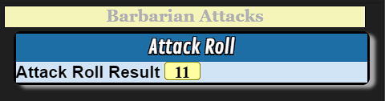

#### Step 3-3 Explanation

### Let's Add the Token's Picture to the Description

```text
!scriptcard {{
    --#sourceToken|@{selected|token_id}
    --#title|Attack Roll
    --#emoteText|Barbarian Attacks
    --=AttackRoll|1d20
    --+Attack Roll Result|[$AttackRoll]
}}
```
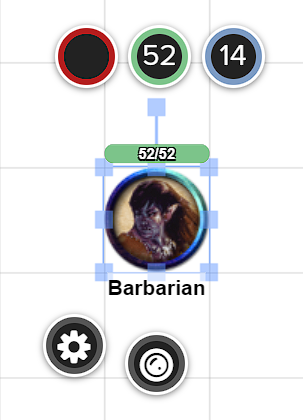
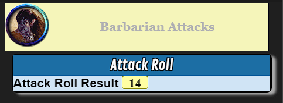

Roll20 processes all @{} references before sending the results to ScriptCards.
If you see the following Roll20 errror, it often means you have @{selected} without having a token selected.

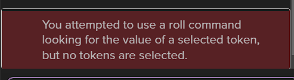

#### Step 3-4 Explanation

### Let's Add the Attacker's Attributes

```text
!scriptcard {{
    --#sourceToken|@{selected|token_id}
    --#title|Attack Roll
    --#emoteText|Barbarian Attacks
    --=AttackRoll|1d20 + [*S:strength_mod] [STR] + [*S:pb] [PROF]
    --+Attack Roll Result|[$AttackRoll]
}}
```
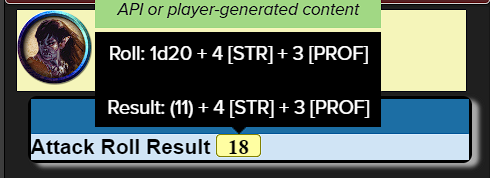

#### Step 3-5 Explanation

### Let's Add a Target for the Attack

```text
!scriptcard {{
    --#sourceToken|@{selected|token_id}
    --#targetToken|@{target|token_id}
    --#title|Attack Roll
    --#emoteText|Barbarian Attacks [*T:t-name]
    --=AttackRoll|1d20 + [*S:strength_mod] [STR] + [*S:pb] [PROF]
    --+Attack Roll Result|[$AttackRoll]
}}
```
Let's add a new token for our character to attack.
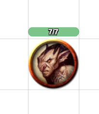
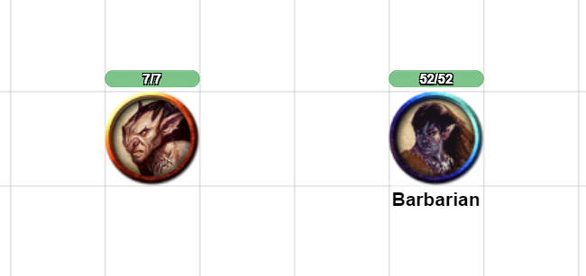
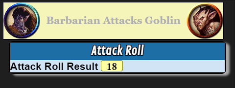

#### Step 3-6 Explanation

### Let's Make It More Portable

```text
!scriptcard {{
    --#sourceToken|@{selected|token_id}
    --#targetToken|@{target|token_id}
    --#title|Attack Roll
    --#emoteText|[*S:character_name] Attacks [*T:t-name]
    --=AttackRoll|1d20 + [*S:strength_mod] [STR] + [*S:pb] [PROF]
    --+Attack Roll Result|[$AttackRoll]
}}
```
Let's add a new attacker token
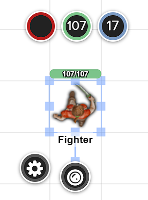
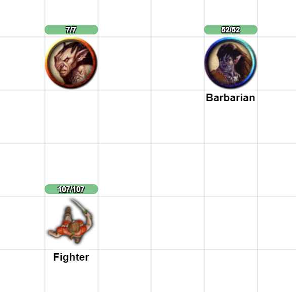
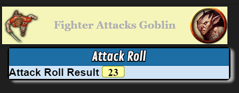
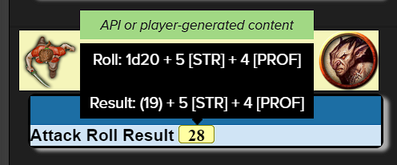

#### Step 3-7 Explanation

### Let's Add the Target's Armor Class

```text
!scriptcard {{
    --#sourceToken|@{selected|token_id}
    --#targetToken|@{target|token_id}
    --#title|Attack Roll
    --#emoteText|[*S:character_name] Attacks [*T:t-name]
    --=AttackRoll|1d20 + [*S:strength_mod] [STR] + [*S:pb] [PROF]
    --+Attack Roll Result|[$AttackRoll] vs Armor Class [*T:t-bar2_value]
}}
```
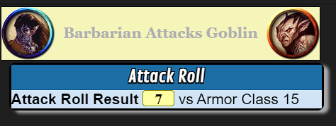

#### Step 3-8 Explanation

### Let's Make the AC Stand-out

```text
!scriptcard {{
    --#sourceToken|@{selected|token_id}
    --#targetToken|@{target|token_id}
    --#title|Attack Roll
    --#emoteText|[*S:character_name] Attacks [*T:t-name]
    --=AttackRoll|1d20 + [*S:strength_mod] [STR] + [*S:pb] [PROF]
    --+Attack Roll Result|[$AttackRoll] vs Armor Class [roll][*T:t-bar2_value][/roll]
}}
```
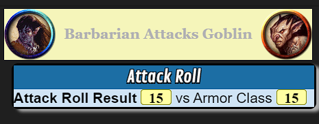

#### Step 3-9 Explanation

### Let's See if the Attack Hits

```text
!scriptcard {{
    --#sourceToken|@{selected|token_id}
    --#targetToken|@{target|token_id}
    --#title|Attack Roll
    --#emoteText|[*S:character_name] Attacks [*T:t-name]
    --=AttackRoll|1d20 + [*S:strength_mod] [STR] + [*S:pb] [PROF]
    --+Attack Roll Result|[$AttackRoll] vs Armor Class [roll][*T:t-bar2_value][/roll]
    --?[$AttackRoll] -ge [*T:t-bar2_value]|Hit|Miss

    --:Done|
    --X|
    --:Hit|
        --+HIT|The [*S:character_name]'s attack hits [*T:t-name]
    --^Done|
    --:Miss|
        --+MISS|The [*S:character_name]'s attack misses [*T:t-name]
    --^Done|
}}
```
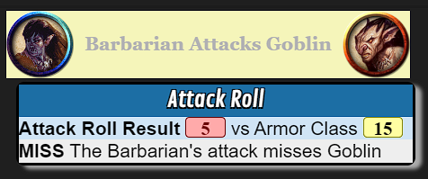

#### Step 3-10 Explanation

### Let's Add Damage to Hits

```text
!scriptcard {{
    --#sourceToken|@{selected|token_id}
    --#targetToken|@{target|token_id}
    --#title|Attack Roll
    --#emoteText|[*S:character_name] Attacks [*T:t-name]
    --=AttackRoll|1d20 + [*S:strength_mod] [STR] + [*S:pb] [PROF]
    --+Attack Roll Result|[$AttackRoll] vs Armor Class [roll][*T:t-bar2_value][/roll]
    --?[$AttackRoll] -ge [*T:t-bar2_value]|Hit|Miss

    --:Done|
    --X|
    --:Hit|
        --=DamageRoll|1d8 + [*S:strength_mod] [STR]
        --+HIT|The [*S:character_name]'s attack hits [*T:t-name] for [$DamageRoll] damage
    --^Done|
    --:Miss|
        --+MISS|The [*S:character_name]'s attack misses [*T:t-name]
    --^Done|
}}
```
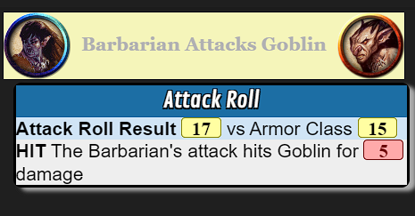

#### Step 3-11 Explanation

### Let's Check for Critical Hits

```text
!scriptcard {{
    --#sourceToken|@{selected|token_id}
    --#targetToken|@{target|token_id}
    --#title|Attack Roll
    --#emoteText|[*S:character_name] Attacks [*T:t-name]
    --=AttackRoll|1d20 + [*S:strength_mod] [STR] + [*S:pb] [PROF]
    --+Attack Roll Result|[$AttackRoll] vs Armor Class [roll][*T:t-bar2_value][/roll]
    --?[$AttackRoll.Base] -eq 20|CriticalHit
    --?[$AttackRoll] -ge [*T:t-bar2_value]|Hit|Miss

    --:Done|
    --X|
    --:CriticalHit|
        --=DamageRoll|1d8 + [*S:strength_mod] [STR]
        --=CriticalDamage|1d8
        --=TotalDamage|[$DamageRoll] + [$CriticalDamage] [CRIT]
        --+CRITICAL|[*S:character_name]'s attack is a critical hit on [*T:t-name] for [$TotalDamage] damage
    --^Done|
    --:Hit|
        --=DamageRoll|1d8 + [*S:strength_mod] [STR]
        --+HIT|The [*S:character_name]'s attack hits [*T:t-name] for [$DamageRoll] damage
    --^Done|
    --:Miss|
        --+MISS|The [*S:character_name]'s attack misses [*T:t-name]
    --^Done|
}}
```
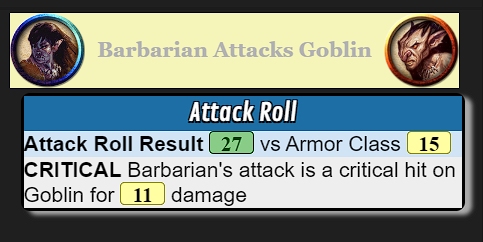
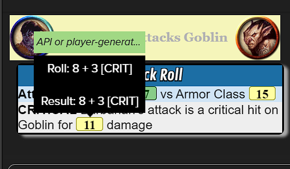

#### Step 3-12 Explanation

## Recap and References
