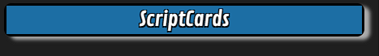

# ScriptCards Tutorial

This is intended to be a tutorial for Roll20 Pro subscribers looking to automate aspects of their games with the very versatile ScriptCards Mod

## Step 1: Installation

The easiest way to install ScriptCards is via the 1Click Mod installation method.
TODO: Add links to installation tutorials

## Step 2: Check ScriptCards is running

In the Roll20 chat, type the following `!script {{ }}`



## Step 3: Your First ScriptCard

### Let's Make an Attack

```text
!scriptcard {{
    --=AttackRoll|1d20
    --+Attack Roll Result|[$AttackRoll]
}}
```
TODO: Add image

### Let's Add a Custom Title

```text
!scriptcard {{
    --#title|Attack Roll
    --=AttackRoll|1d20
    --+Attack Roll Result|[$AttackRoll]
}}
```
TODO: Add image

### Let's Add a Description

```text
!scriptcard {{
    --#title|Attack Roll
    --#emoteText|Barbarian Attacks
    --=AttackRoll|1d20
    --+Attack Roll Result|[$AttackRoll]
}}
```
TODO: Add image

### Let's Add the Token's Picture to the Description

```text
!scriptcard {{
    --#sourceToken|@{selected|token_id}
    --#title|Attack Roll
    --#emoteText|Barbarian Attacks
    --=AttackRoll|1d20
    --+Attack Roll Result|[$AttackRoll]
}}
```
TODO: Add image

### Let's Add the Attacker's Attributes

```text
!scriptcard {{
    --#sourceToken|@{selected|token_id}
    --#title|Attack Roll
    --#emoteText|Barbarian Attacks
    --=AttackRoll|1d20 + [*S:strength_mod] [STR] + [*S:pb] [PROF]
    --+Attack Roll Result|[$AttackRoll]
}}
```
TODO: Add image

### Let's Add a Target for the Attack

```text
!scriptcard {{
    --#sourceToken|@{selected|token_id}
    --#targetToken|@{target|token_id}
    --#title|Attack Roll
    --#emoteText|Barbarian Attacks [*T:t-name]
    --=AttackRoll|1d20 + [*S:strength_mod] [STR] + [*S:pb] [PROF]
    --+Attack Roll Result|[$AttackRoll]
}}
```
TODO: Add image

### Let's Make It More Portable

```text
!scriptcard {{
    --#sourceToken|@{selected|token_id}
    --#targetToken|@{target|token_id}
    --#title|Attack Roll
    --#emoteText|[*S:character_name] Attacks [*T:t-name]
    --=AttackRoll|1d20 + [*S:strength_mod] [STR] + [*S:pb] [PROF]
    --+Attack Roll Result|[$AttackRoll]
}}
```
TODO: Add image
TODO: Add image2

### Let's Make the AC Stand-out

```text
!scriptcard {{
    --#sourceToken|@{selected|token_id}
    --#targetToken|@{target|token_id}
    --#title|Attack Roll
    --#emoteText|[*S:character_name] Attacks [*T:t-name]
    --=AttackRoll|1d20 + [*S:strength_mod] [STR] + [*S:pb] [PROF]
    --+Attack Roll Result|[$AttackRoll] vs Armor Class [roll][*T:t-bar2_value][/roll]
}}
```
TODO: Add image

### Let's See if the Attack Hits

```text
!scriptcard {{
    --#sourceToken|@{selected|token_id}
    --#targetToken|@{target|token_id}
    --#title|Attack Roll
    --#emoteText|[*S:character_name] Attacks [*T:t-name]
    --=AttackRoll|1d20 + [*S:strength_mod] [STR] + [*S:pb] [PROF]
    --+Attack Roll Result|[$AttackRoll] vs Armor Class [roll][*T:t-bar2_value][/roll]
    --?[$AttackRoll] -ge [*T:t-bar2_value]|Hit|Miss

    --:Done|
    --X|
    --:Hit|
        --+HIT|The [*S:character_name]'s attack hits [*T:t-name]
    --^Done|
    --:Miss|
        --+MISS|The [*S:character_name]'s attack misses [*T:t-name]
    --^Done|
}}
```
TODO: Add image

### Let's Add Damage to Hits

```text
!scriptcard {{
    --#sourceToken|@{selected|token_id}
    --#targetToken|@{target|token_id}
    --#title|Attack Roll
    --#emoteText|[*S:character_name] Attacks [*T:t-name]
    --=AttackRoll|1d20 + [*S:strength_mod] [STR] + [*S:pb] [PROF]
    --+Attack Roll Result|[$AttackRoll] vs Armor Class [roll][*T:t-bar2_value][/roll]
    --?[$AttackRoll] -ge [*T:t-bar2_value]|Hit|Miss

    --:Done|
    --X|
    --:Hit|
        --=DamageRoll|1d8 + [*S:strength_mod] [STR]
        --+HIT|The [*S:character_name]'s attack hits [*T:t-name] for [$DamageRoll] damage
    --^Done|
    --:Miss|
        --+MISS|The [*S:character_name]'s attack misses [*T:t-name]
    --^Done|
}}
```
TODO: Add image

### Let's Check for Critical Hits

```text
!scriptcard {{
    --#sourceToken|@{selected|token_id}
    --#targetToken|@{target|token_id}
    --#title|Attack Roll
    --#emoteText|[*S:character_name] Attacks [*T:t-name]
    --=AttackRoll|1d20 + [*S:strength_mod] [STR] + [*S:pb] [PROF]
    --+Attack Roll Result|[$AttackRoll] vs Armor Class [roll][*T:t-bar2_value][/roll]
    --?[$AttackRoll.Base] -eq 20|CriticalHit
    --?[$AttackRoll] -ge [*T:t-bar2_value]|Hit|Miss

    --:Done|
    --X|
    --:CriticalHit|
        --=DamageRoll|1d8 + [*S:strength_mod] [STR]
        --=CriticalDamage|1d8
        --=TotalDamage|[$DamageRoll] + [$CriticalDamage] [CRIT]
        --+CRITICAL|[*S:character_name]'s attack is a critical hit on [*T:t-name] for [$TotalDamage] damage
    --^Done|
    --:Hit|
        --=DamageRoll|1d8 + [*S:strength_mod] [STR]
        --+HIT|The [*S:character_name]'s attack hits [*T:t-name] for [$DamageRoll] damage
    --^Done|
    --:Miss|
        --+MISS|The [*S:character_name]'s attack misses [*T:t-name]
    --^Done|
}}
```
TODO: Add image
