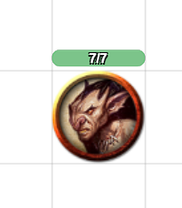
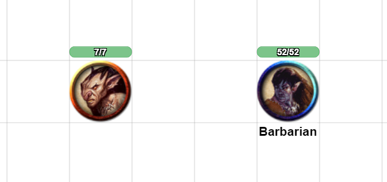
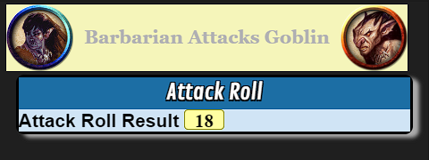
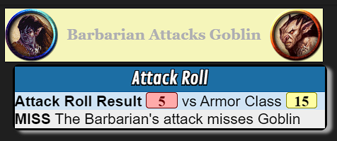
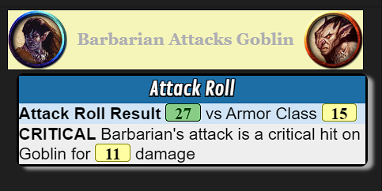

# ScriptCards Tutorial Number 1 - Your First ScriptCard

This is intended to be a tutorial for Roll20 Pro subscribers looking to automate aspects of their games with the very versatile ScriptCards Mod

## Pre-requisites

This tutorial requires a Roll20 game created by someone with a Pro subscription. This will allow API Mods to be installed which ScriptCards is an API Mod.

While ScriptCards is not game system specific, this first tutorial will use a game created with the D&D 5e Character Sheet by Roll20.

2 Player characters created and linked to tokens. 1 NPC character token dragged from the compendium with its Armor Class linked to token bar2.

## Step 1: Installation

The easiest way to install ScriptCards is via the 1Click Mod installation method.

[Roll20 Mod installation Documentation](https://help.roll20.net/hc/en-us/articles/360037256714-Roll20-Mods-API#API-HowdoIinstallanAPIscriptusingtheone-clickscriptlibrary?)
[Nick Olivo YouTube video showing API installation](https://www.youtube.com/watch?v=jam2yx8btaQ)

## Step 2: Check ScriptCards is running

In the Roll20 chat, type the following `!script {{ }}`


#### Step 2 Explanation

Roll20 API Mods like ScriptCards are marked by an exclamation point. ScriptCards will respond to !script and !scriptcard. They are equivalent and tutorials might use either interchangably.

ScriptCards code goes between pairs of double curly braces. Two opening curly braces starts the processing of a ScriptCard and two closing curly braces signals the end of the ScriptCard.

Seeing the output above will show that your game's API sandbox is running and ScriptCards Mod is installed and running.

## Step 3: Your First ScriptCard

### Let's Make an Attack

```text
!scriptcard {{
    --=AttackRoll|1d20
    --+Attack Roll Result|[$AttackRoll]
}}
```


#### Step 3-1 Explanation

ScriptCards statements all begin with a double dash. In this example, we use `--=` to declare a [Roll variable](https://wiki.roll20.net/Script:ScriptCards#Roll_Variable_Assignment_.28--.3D.29)

When declaring a roll variable the name of the variable goes before the pipe character `|` and the contents of the variable go after the pipe. In this example, we named the roll variable AttackRoll and rolled 1d20.

The next line we use [direct output](https://wiki.roll20.net/Script:ScriptCards#Direct_Output_.28--.2B.29) to output a message to chat using `--+`.

In direct output, things to the left of the pipe character are bolded. The remaining output to the right of the line is not bolded by default.

In this example Attack Roll Result is bolded and the result of the roll variable name AttackRoll is added to the output using `[$ROLL_VARIABLE_NAME]`

### Let's Add a Custom Title

```text
!scriptcard {{
    --#title|Attack Roll
    --=AttackRoll|1d20
    --+Attack Roll Result|[$AttackRoll]
}}
```


#### Step 3-2 Explanation

The new line is this ScriptCard uses `--#` to set a [ScriptCard Parameter](https://wiki.roll20.net/Script:ScriptCards#Set_Parameter_.28--.23.29) to add a custom and more descriptive title to the ScriptCard.

### Let's Add a Description

```text
!scriptcard {{
    --#title|Attack Roll
    --#emoteText|Barbarian Attacks
    --=AttackRoll|1d20
    --+Attack Roll Result|[$AttackRoll]
}}
```


#### Step 3-3 Explanation

The new line in step 3-3 adds another ScriptCards parameter, emoteText, to give some more custom description to the ScriptCard.

### Let's Add the Token's Picture to the Description

```text
!scriptcard {{
    --#sourceToken|@{selected|token_id}
    --#title|Attack Roll
    --#emoteText|Barbarian Attacks
    --=AttackRoll|1d20
    --+Attack Roll Result|[$AttackRoll]
}}
```


Roll20 processes all @{} references before sending the results to ScriptCards.
If you see the following Roll20 errror, it often means you have @{selected} without having a token selected.


#### Step 3-4 Explanation

The new line in step3-4 adds another ScriptCards parameter to set the sourceToken to the currently selected token.

Roll20 processes all attribute @{} references, ability call %{} references, and roll queries ?{} before sending the results to ScriptCards.

In this example, by the time ScriptCards processes output the line `--#sourceToken|@{selected|token_id}` will appear like `--#sourceToken|-20CharacterTOKENID` with Roll20 processing @{} before passing output to ScriptCards.

For this example, sourceToken places the token image in the ScriptCards output. We'll explore other benefits to setting sourceToken later in this tutorial.

### Let's Add the Attacker's Attributes

```text
!scriptcard {{
    --#sourceToken|@{selected|token_id}
    --#title|Attack Roll
    --#emoteText|Barbarian Attacks
    --=AttackRoll|1d20 + [*S:strength_mod] [STR] + [*S:pb] [PROF]
    --+Attack Roll Result|[$AttackRoll]
}}
```


#### Step 3-5 Explanation

In step3-5 we modify the AttackRoll roll variable to add the attacker's strength_mod character attribute and the attacker's pb character attribute.

With a sourceToken set, ScriptCards will allow [Object Attribute Referencing](https://wiki.roll20.net/Script:ScriptCards#Object_Attribute_Referencing) using `[*S:ATTRIBUTE]` syntax.

When a Roll variable is directly output, you can hover over the roll output to see the results of the roll and the modifications to the roll.

`[STR]` and `[PROF]` are [Roll variable flavor text](https://wiki.roll20.net/Script:ScriptCards#Adding_Flavor_Text_to_Rolls) to help make hover output more descriptive and clearer.

### Let's Add a Target for the Attack

```text
!scriptcard {{
    --#sourceToken|@{selected|token_id}
    --#targetToken|@{target|token_id}
    --#title|Attack Roll
    --#emoteText|Barbarian Attacks [*T:t-name]
    --=AttackRoll|1d20 + [*S:strength_mod] [STR] + [*S:pb] [PROF]
    --+Attack Roll Result|[$AttackRoll]
}}
```
Let's add a new token for our character to attack.




#### Step 3-6 Explanation

Step3-6 adds a new ScriptCards parameter `--#targetToken` and uses Roll20's targetting system.

As before all @{} references are processed before ScriptCards so @{target} lines will always run first.

With targetToken parameter set, ScriptCards will allow object attribute referencing using `[*T:ATTRIBUTE]` syntax.

Additionally with object attribute references for both source and target tokens, you can get [Roll20 Token Properties](https://help.roll20.net/hc/en-us/articles/360037772793-API-Objects#API:Objects-Graphic(Token/Map/Card/Etc.)) with `[*T:t-PROPERTYNAME]`

In this example we add the target's token name to the `--#emoteText` setting with `[*T:t-name]`

### Let's Make It More Portable

```text
!scriptcard {{
    --#sourceToken|@{selected|token_id}
    --#targetToken|@{target|token_id}
    --#title|Attack Roll
    --#emoteText|[*S:character_name] Attacks [*T:t-name]
    --=AttackRoll|1d20 + [*S:strength_mod] [STR] + [*S:pb] [PROF]
    --+Attack Roll Result|[$AttackRoll]
}}
```
Let's add a new attacker token


#### Step 3-7 Explanation

Up until now, we've had the attacker's name hardcoded into the ScriptCard's emoteText but now that we have sourceToken selected we can change the ScriptCard to get the name of the attacker so we can use the same ScriptCard for different attackers.

We change the `--#emoteText` setting to use the sourceToken's character_name attribute with `[*S:character_name]`

This will allow the same ScriptCard for each attacker and all sourceToken references get updated depending on the selected token.

In the output you can see that Fighter attacker has different character_name, strength_mod, and pb attributes than the Barbarian attacker.

These references allow your ScriptCards to be more flexible and portable than if you had to hardcode values.

### Let's Add the Target's Armor Class

```text
!scriptcard {{
    --#sourceToken|@{selected|token_id}
    --#targetToken|@{target|token_id}
    --#title|Attack Roll
    --#emoteText|[*S:character_name] Attacks [*T:t-name]
    --=AttackRoll|1d20 + [*S:strength_mod] [STR] + [*S:pb] [PROF]
    --+Attack Roll Result|[$AttackRoll] vs Armor Class [*T:t-bar2_value]
}}
```


#### Step 3-8 Explanation

Step 3-8 modifies the output line `--+` to display the attack target's Armor Class. In this case, it will use the value in the target token's bar2 value `[*T:t-bar2_value]`

You see that token properties are references with the `:t-` prefix. Without that `:t-` prefix, ScriptCards will look for character attributes.

### Let's Make the AC Stand-out

```text
!scriptcard {{
    --#sourceToken|@{selected|token_id}
    --#targetToken|@{target|token_id}
    --#title|Attack Roll
    --#emoteText|[*S:character_name] Attacks [*T:t-name]
    --=AttackRoll|1d20 + [*S:strength_mod] [STR] + [*S:pb] [PROF]
    --+Attack Roll Result|[$AttackRoll] vs Armor Class [roll][*T:t-bar2_value][/roll]
}}
```


#### Step 3-9 Explanation

Step3-9 adds a some [Inline Formatting](https://wiki.roll20.net/Script:ScriptCards#Inline_Formatting) to make the target's AC value stand out more in the output using the `[roll]...[/roll]` syntax.

Direct output allows for many formatting options to make your ScriptCards output more customizable to your visual needs.

### Let's See if the Attack Hits

```text
!scriptcard {{
    --#sourceToken|@{selected|token_id}
    --#targetToken|@{target|token_id}
    --#title|Attack Roll
    --#emoteText|[*S:character_name] Attacks [*T:t-name]
    --=AttackRoll|1d20 + [*S:strength_mod] [STR] + [*S:pb] [PROF]
    --+Attack Roll Result|[$AttackRoll] vs Armor Class [roll][*T:t-bar2_value][/roll]
    --?[$AttackRoll] -ge [*T:t-bar2_value]|Hit|Miss

    --:Done|
    --X|
    --:Hit|
        --+HIT|The [*S:character_name]'s attack hits [*T:t-name]
    --^Done|
    --:Miss|
        --+MISS|The [*S:character_name]'s attack misses [*T:t-name]
    --^Done|
}}
```


#### Step 3-10 Explanation

So up until now, we've grabbed attributes and properties and displayed them but Step 3-10 is where ScriptCards separates itself from Roll20 macros.

Step 3-10 uses the `--?` [Conditional statement](https://wiki.roll20.net/Script:ScriptCards#Conditional_Statement_.28--.3F.29) to compare the total of the AttackRoll roll variable to the target's AC.

In the above example, ScriptCards checks to see if the AttackRoll is greater than or equal to the target's AC. If that is true, ScriptCards will jump output to the label named Hit. If not true, ScriptCards will jump to the label named Miss.

ScriptCards conditionals are in the form of `--? CONDITION TO CHECK | WHAT TO DO IF TRUE | WHAT TO DO IF FALSE`.

ScriptCards has the ability to add a [Label](https://wiki.roll20.net/Script:ScriptCards#Branch_Label_.28--:.29) using `--:`

In this example we have added 3 branch labels, `--:Done|`, `--:Hit|`, and `--:Miss|`

The conditional statement's default is to GOTO a branch. So in this case after the conditional line `--?` we end up in either `--:Hit|` or `--:Miss|` Depending.

Each of those sections will output the result of the attack roll and then jump to the `--:Done|` label using `--^` syntax to [Branch](https://wiki.roll20.net/Script:ScriptCards#Branch_.28--.5E.29).

The final new item in this step is the Exit Script `--X|` statement which means ScriptCards will stop processing when it hits that code.

Note that with conditional branching we were able to jump to code labels below the exit `--X|` and then jump back above the exit when finished.

Conditionals and Code Branches make ScriptCards incredibly versatile and powerful.

### Let's Add Damage to Hits

```text
!scriptcard {{
    --#sourceToken|@{selected|token_id}
    --#targetToken|@{target|token_id}
    --#title|Attack Roll
    --#emoteText|[*S:character_name] Attacks [*T:t-name]
    --=AttackRoll|1d20 + [*S:strength_mod] [STR] + [*S:pb] [PROF]
    --+Attack Roll Result|[$AttackRoll] vs Armor Class [roll][*T:t-bar2_value][/roll]
    --?[$AttackRoll] -ge [*T:t-bar2_value]|Hit|Miss

    --:Done|
    --X|
    --:Hit|
        --=DamageRoll|1d8 + [*S:strength_mod] [STR]
        --+HIT|The [*S:character_name]'s attack hits [*T:t-name] for [$DamageRoll] damage
    --^Done|
    --:Miss|
        --+MISS|The [*S:character_name]'s attack misses [*T:t-name]
    --^Done|
}}
```


#### Step 3-11 Explanation

Step 3-11 adds a new Roll variable named DamageRoll to the Hit code branch.

DamageRoll is currently hardcoded to roll a 1d8 and add the attacker's strength_mod attribute to it.

The Hit branch's direct output line then adds the DamageRoll to its output.

### Let's Check for Critical Hits

```text
!scriptcard {{
    --#sourceToken|@{selected|token_id}
    --#targetToken|@{target|token_id}
    --#title|Attack Roll
    --#emoteText|[*S:character_name] Attacks [*T:t-name]
    --=AttackRoll|1d20 + [*S:strength_mod] [STR] + [*S:pb] [PROF]
    --+Attack Roll Result|[$AttackRoll] vs Armor Class [roll][*T:t-bar2_value][/roll]
    --?[$AttackRoll.Base] -eq 20|CriticalHit
    --?[$AttackRoll] -ge [*T:t-bar2_value]|Hit|Miss

    --:Done|
    --X|
    --:CriticalHit|
        --=DamageRoll|1d8 + [*S:strength_mod] [STR]
        --=CriticalDamage|1d8
        --=TotalDamage|[$DamageRoll] + [$CriticalDamage] [CRIT]
        --+CRITICAL|[*S:character_name]'s attack is a critical hit on [*T:t-name] for [$TotalDamage] damage
    --^Done|
    --:Hit|
        --=DamageRoll|1d8 + [*S:strength_mod] [STR]
        --+HIT|The [*S:character_name]'s attack hits [*T:t-name] for [$DamageRoll] damage
    --^Done|
    --:Miss|
        --+MISS|The [*S:character_name]'s attack misses [*T:t-name]
    --^Done|
}}
```



#### Step 3-12 Explanation

Step 3-12 adds a new conditional check and a new code branch label to check for and process critical hits on rolls of a natural 20.

The new conditional statement `--?[$AttackRoll.Base] -eq 20|CriticalHit` uses a [Roll Modifier](https://wiki.roll20.net/Script:ScriptCards#Roll_Modifiers) to the AttackRoll roll variable.

`.Base` will ouput only the dice rolls for the roll variable. In this case the result of 1d20 without any of the static modifiers. So if the `.Base` result of AttackRoll is 20, then AttackRoll was a natural 20 and thus an automatic hit and a critical hit.

If `.Base` is not equal to 20, there is no ELSE or FALSE part of this conditional so ScriptCards will move on to the next statement.

If `.Base` is equal to 20, then we jump the code label `--:CriticalHit|` where we have 3 roll variables. The normal DamageRoll that we have in the Hit label, CriticalDamage roll variable, and then add those together in the TotalDamage roll variable.

We then display that the attack was a CRITICAL in the output and display the total damage rolled by the DamageRoll and CriticalDamage.

Finally we jump to the `--:Done|` label to exit the script.

### Let's Apply Damage to the Target

```text
!scriptcard {{
    --#sourceToken|@{selected|token_id}
    --#targetToken|@{target|token_id}
    --#title|Attack Roll
    --#emoteText|[*S:character_name] Attacks [*T:t-name]
    --=AttackRoll|1d20 + [*S:strength_mod] [STR] + [*S:pb] [PROF]
    --+Attack Roll Result|[$AttackRoll] vs Armor Class [roll][*T:t-bar2_value][/roll]
    --?[$AttackRoll.Base] -eq 20|CriticalHit
    --?[$AttackRoll] -ge [*T:t-bar2_value]|Hit|Miss

    --:Done|
    --X|
    --:CriticalHit|
        --=DamageRoll|1d8 + [*S:strength_mod] [STR]
        --=CriticalDamage|1d8
        --=TotalDamage|[$DamageRoll] + [$CriticalDamage] [CRIT]
        --+CRITICAL|[*S:character_name]'s attack is a critical hit on [*T:t-name] for [$TotalDamage] damage
        -->ApplyDamageToToken|[*T:t-id];[$TotalDamage]
    --^Done|
    --:Hit|
        --=DamageRoll|1d8 + [*S:strength_mod] [STR]
        --+HIT|The [*S:character_name]'s attack hits [*T:t-name] for [$DamageRoll] damage
        -->ApplyDamageToToken|[*T:t-id];[$DamageRoll]
    --^Done|
    --:Miss|
        --+MISS|The [*S:character_name]'s attack misses [*T:t-name]
    --^Done|
    --:ApplyDamageToToken|TokenID;DamageToApply
        --!t:[%1%]|bar1_value:-=[%2%]
    --<|
}}
```


#### Step 3-13 Explanation

Now that we know whether the attack hits, misses, or critical hits, we can take the next step to apply the damage rolled to the target token.

We could add [Object Modification](https://wiki.roll20.net/Script:ScriptCards#Object_Modification_.28--.21.29) using `--!` to both Hit and CriticalHit branches but since the steps are the same, we'll add a new code branch named `--:ApplyDamageToToken|`

You may notice that after the pipe character for `--:ApplyDamageToToken|` there is `TokenID;DamageToApply` these are not used by ScriptCards. These are added to help document what the parameters that get passed into ApplyDamageToToken represent.

In both CriticalHit and Hit branches we add a [Procedure Call](https://wiki.roll20.net/Script:ScriptCards#Call_Procedure_.28--.3E.29) using `-->LABELNAME|PARAMETER1;PARAMETER2` syntax.

In both CriticalHit and Hit we pass in the target's token id with the object attribute reference `[*T:t-id]` and then we pass in the damage rolled in each branch. In the case of CriticalHit it is the TotalDamage roll variable and in the case of Hit it's the DamageRoll roll variable.

ScriptCards will then jump to the ApplyDamageToToken branch and start processing.

Here we use ScriptCard's [Object Modification](https://wiki.roll20.net/Script:ScriptCards#Object_Modification_.28--.21.29) which uses syntax like `--!<objectType>:<objectId>|[setting:value]|[setting:value]|[setting:value]...` to make modifications.

ScriptCards provides some shortcuts for object types in some cases, in this case `t` for token. So `--!t` means modify the token.

When you use a procedure call, following the pipe character you can pass in parameters to use in that code branch. In this case we pass in 2 parameters separated by a semi-colon `;`

Inside that procedure the first parameter is accessed by `[%1%]` and the second parameter is accessed by `[%2%]

So in our case `--!t:[%1%]|` will tell ScriptCards that we want to modify properties for the token with the TokenID we passed in as the first parameter.

After the pipe character, we list the properties and attributes we want to modify. In this case `bar1_value`

with ScriptCards modification if you want to set a value, you would use the syntax of property name `bar1_value`, colon `:`, and value to set the property.

ScriptCards will allow you increment or decrement values with syntax of `:+=` and `:-=` respectively. In our case we want to decrement bar1_value by the damage rolled and passed in as the second parameter `bar1_value:-=[%2%]`

Finally, when you use `-->` to call a procedure you can return to the code branch that called the procedure with the [Return](https://wiki.roll20.net/Script:ScriptCards#Return_.28--.3C.29) syntax `--<|`

### Let's Make it Easier to Change

```text
!scriptcard {{
    --/|VARIABLES TO SET
    --&HPBar|1
    --&DamageDieSize|1d8

    --#sourceToken|@{selected|token_id}
    --#targetToken|@{target|token_id}
    --#title|Attack Roll
    --#emoteText|[*S:character_name] Attacks [*T:t-name]
    --=AttackRoll|1d20 + [*S:strength_mod] [STR] + [*S:pb] [PROF]
    --+Attack Roll Result|[$AttackRoll] vs Armor Class [roll][*T:t-bar2_value][/roll]
    --?[$AttackRoll.Base] -eq 20|CriticalHit
    --?[$AttackRoll] -ge [*T:t-bar2_value]|Hit|Miss

    --:Done|
    --X|
    --:CriticalHit|
        --=DamageRoll|[&DamageDieSize] + [*S:strength_mod] [STR]
        --=CriticalDamage|[&DamageDieSize]
        --=TotalDamage|[$DamageRoll] + [$CriticalDamage] [CRIT]
        --+CRITICAL|[*S:character_name]'s attack is a critical hit on [*T:t-name] for [$TotalDamage] damage
        -->ApplyDamageToToken|[*T:t-id];[$TotalDamage]
    --^Done|
    --:Hit|
        --=DamageRoll|[&DamageDieSize] + [*S:strength_mod] [STR]
        --+HIT|The [*S:character_name]'s attack hits [*T:t-name] for [$DamageRoll] damage
        -->ApplyDamageToToken|[*T:t-id];[$DamageRoll]
    --^Done|
    --:Miss|
        --+MISS|The [*S:character_name]'s attack misses [*T:t-name]
    --^Done|
    --:ApplyDamageToToken|TokenID;DamageToApply
        --!t:[%1%]|bar[&HPBar]_value:-=[%2%]
    --<|
}}
```

#### Step 3-14 Explanation

Step 3-14 uses some [String variables](https://wiki.roll20.net/Script:ScriptCards#String_Variable_Assignment_.28--.26.29) to make some configuration settings at the top of the script.

We add a [Comment](https://wiki.roll20.net/Script:ScriptCards#Comment_.28--.2F.29) using `--/|`.

ScriptCards will ignore comment lines starting with `--/|` but they can be handy to explain and document portions of the code for others to use and also for your future self when you haven't looked at it in months and months.

We add 2 String variables `--&HPBar|` and `--&DamageDieSize|`

While I have my token's hit points mapped to bar 1, other game runners may map to bar 2 or bar 3. This will allow a new game to adjust that HPBar easily right at the top of the script.

Then in the `--:ApplyDamageToToken|` branch we change `bar1_value` to use the String variable `bar[&HPBar]_value` and ScriptCards will substitute the value of that String variable in when it runs.

The other String variable we add is `--&DamageDieSize|` and we set that value to `1d8` We then replace 1d8 in the DamageRoll roll variables in both CriticalHit and Hit and also the 1d8 in the CriticalDamage roll variable

ScriptCards will then substitue 1d8 in those roll variables in place of `[&DamageDieSize]`

This will allow us to change the damage die rolled in 1 location near the top of the script instead of having to change in multiple locations throughout the ScriptCard

## Recap and References

In this first tutorial we have gone from installing ScriptCards and running `!script {{ }}` to test that it is running ok, to building a ScriptCard capable of chosing a target for an attack, rolling the attack using the selected token's attributes to modify the roll, comparing the results of the attack roll to the target's armor class and checking for a critical hit, hit, or miss. On a hit, rolls damage and automatically modify the target's token to subtract the damage roll.

And this is just the start of what ScriptCards is capable of and subsequent tutorials will go through more language features and how to use them to improve, automate, and streamline your Roll20 games.

### Language Features Used

* [Roll variable](https://wiki.roll20.net/Script:ScriptCards#Roll_Variable_Assignment_.28--.3D.29) - Used for rolls. `--=Name|value` to set and `[$Name]` to reference
* [Direct output](https://wiki.roll20.net/Script:ScriptCards#Direct_Output_.28--.2B.29) - Used to display information in the Roll20 chat
* [ScriptCard Parameter](https://wiki.roll20.net/Script:ScriptCards#Set_Parameter_.28--.23.29) - Sets ScriptCards parameters with `--#` for things like `--#title|`, `--#emoteText|`, `--#sourceToken|`, and `--#targetToken|`
* [Object Attribute Referencing](https://wiki.roll20.net/Script:ScriptCards#Object_Attribute_Referencing) - allows the use of getting an objects attributes and properties with syntax like `[*S:ATTRIBUTENAME]` for source tokens and `[*T:ATTRIBUTENAME]` for target tokens
* [Roll variable flavor text](https://wiki.roll20.net/Script:ScriptCards#Adding_Flavor_Text_to_Rolls) - allows adding descriptive text to Roll variables for hover using `[TEXT]`
* [Inline Formatting](https://wiki.roll20.net/Script:ScriptCards#Inline_Formatting) - adding formatting options to the output to make things appear like rolls with `[roll]...[/roll]` or center `[c]...[/c]` or bold `[b]...[/b]` or many other formatting options
* [Conditional statement](https://wiki.roll20.net/Script:ScriptCards#Conditional_Statement_.28--.3F.29) - conditionals allow runtime decisions based on whether the condtion is true or false `--?"[&VARIABLE]" -eq "test"|TRUE|FALSE`
* [Label](https://wiki.roll20.net/Script:ScriptCards#Branch_Label_.28--:.29) - labels to name code branches `--:LABELNAME|` which allows ScriptCards to move around to different branches. Useful with conditional statements
* [Branch](https://wiki.roll20.net/Script:ScriptCards#Branch_.28--.5E.29) - Goto a specific code branch. Useful when you know after a certain section of code runs, you should go to a specific new section of code.
* The Exit statement `--X|` - tells ScriptCards to stop processing at that point.
* [Roll Modifier](https://wiki.roll20.net/Script:ScriptCards#Roll_Modifiers) - Roll modifiers are useful to check different aspects of a Roll variable. One use is to check the rolled total of die `[$ROLLVARIABLE.Base]` without any of the additional modifications to the roll
* [Object Modification](https://wiki.roll20.net/Script:ScriptCards#Object_Modification_.28--.21.29) - Object modification allows ScriptCards quite a lot of control over all the [Roll20 Objects](https://help.roll20.net/hc/en-us/articles/360037772793-API-Objects).
* [Comment](https://wiki.roll20.net/Script:ScriptCards#Comment_.28--.2F.29) - ScriptCards ignored line to help document and describe for users and maintainers
* [String variables](https://wiki.roll20.net/Script:ScriptCards#String_Variable_Assignment_.28--.26.29) - A variable stored and referenced using `--&` allowing strings to be stored for use throughout a ScriptCard. Helps make code portable, more easily modified, and less prone to errors in forgetting to update one section.
