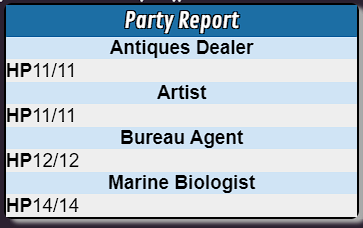
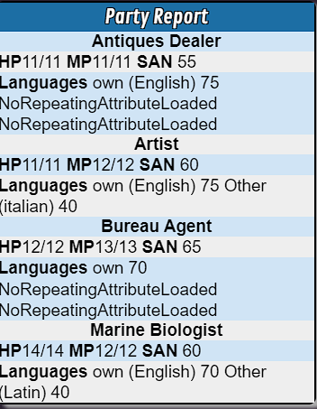

# Tutorial 2 - GM Party Report with Arrays, Loops, Repeating Sections, and Built-in Functions

## Prequisites

This tutorial uses the Call of Cthulhu module the Lightless Beacon which is available for free on Roll20.

If you want to follow along, create a new test game using the Lightless Beacon module which will use the Call of Cthulhu 7th Edition by Roll20 character sheet. When the game is created, install the ScriptCards API Mod.

The Lightless Beacon module comes with 4 pre-built Investigators so let's drag all of those tokens out on to the Landing Page.

## GM Party Report

### Step 1 - GM Report

With all of the 4 Investigator tokens selected, run the following:

```text
!script {{
    --#title|Party Report
    --#whisper|gm
    --%tokenid|foreach;SC_SelectedTokens
        --+[*[&tokenid]:character_name]|
    --%|
}}
```


#### Step 1 Explanation

In this step we use the `--#title|` parameter that we learned in tutorial 1.

Next we use a new [ScriptCard Parameter](https://wiki.roll20.net/Script:ScriptCards#Parameter_Definitions_and_Details) `--#whisper|gm`

Since this is a party report to be used only by the GM, using the parameter to whisper the output to the GM will prevent the party from seeing information that the GM may not want them to see.

The next line is the start of a [For Each Loop](https://wiki.roll20.net/Script:ScriptCards#For_Each_Loops). ScriptCards has other types of loop structures but for now lets focus on the foreach loop.

The foreach loop goes over an [Array](https://wiki.roll20.net/Script:ScriptCards#Arrays). Arrays are essentially a list of items.

In this example we are doing a foreach loop over a [Pre-defined Array](https://wiki.roll20.net/Script:ScriptCards#Predefined_Arrays) named SC_SelectedTokens which contains the token id's of all the selected tokens

The foreach loop will then set a [String variable](https://wiki.roll20.net/Script:ScriptCards#String_Variable_Assignment_.28--.26.29) named `tokenid` as we defined by `--%tokenid|`.

With each iteration of the loop, the string variable `[&tokenid]` will change to the current item in the array.

The inner portion of the loop, we then use the direct output statement `--+|` that we learned in tutorial 1.

We then use a new form of [Object Attribute Referencing](https://wiki.roll20.net/Script:ScriptCards#Object_Attribute_Referencing)

In tutorial 1 we used `[*S:attribute]` and `[*T:t-tokenproperty]` references now we use a similar reference, `[*id:]`

In our example the ID is the token id stored in the string variable `[&tokenid]`

This then displays the `character_name` attribute for each character on its own line

### Step 2 - Let's add some actual information we would want to know

```text
!script {{
    --#title|Party Report
    --#whisper|gm
    --%tokenid|foreach;SC_SelectedTokens
        --+|[c][b][*[&tokenid]:character_name][/b][/c]
        --+|[b]HP[/b][*[&tokenid]:hitpoints]/[*[&tokenid]:hitpoints^]
    --%|
}}
```


#### Step 2 Explanation

In step 2 we modified the output line with the character_name to use [Inline Formatting](https://wiki.roll20.net/Script:ScriptCards#Inline_Formatting) similar to what we learned in tutorial 1.

This time we center the character name with `[c]...[/c]` and bold the output with `[b]...[/b]`

We then added a line to the loop to output another line for each iteration of the loop.

The new line bolds HP and uses the same `[*id:]` object attribute referencing that we did in step 1 to retrieve the `hitpoints` attribute.

We also a second `[*id:]` lookup to grab the max of the `hitpoints` attribute.

[Roll20 Attributes](https://help.roll20.net/hc/en-us/articles/360037772793-API-Objects#API:Objects-Attribute) have a `current` property and a `max` property.

With ScriptCards, we have seen how to access the `current` property, `[*id:ATTRIBUTENAME]`

Now we see how ScriptCards will lookup the `max` property and that is by adding a caret `^` symbol to the attribute name like `[*[&tokenid]:hitpoints^]`

### Step 3 - Let's add more info

```text
!script {{
    --#title|Party Report
    --#whisper|gm
    --%tokenid|foreach;SC_SelectedTokens
        --+|[c][b][*[&tokenid]:character_name][/b][/c]
        --+|[b]HP[/b][*[&tokenid]:hitpoints]/[*[&tokenid]:hitpoints^] [b]MP[/b][*[&tokenid]:magicpoints]/[*[&tokenid]:magicpoints^] [b]SAN[/b] [*[&tokenid]:sanity]
    --%|
}}
```


#### Step 3 Explanation

In step 3 we add more items to get a party report. On the same line that we had hitpoints, we add lines for magicpoints and the max magicpoints and also the current sanity attribute for each of the selected party.

We used inline formatting and object attribute referencing that we have already learned.

### Step 4 - Let's reduce the super long line

```text
!script {{
    --#title|Party Report
    --#whisper|gm
    --%tokenid|foreach;SC_SelectedTokens
        --+|[c][b][*[&tokenid]:character_name][/b][/c]
        --&statusMsg|[b]HP[/b][*[&tokenid]:hitpoints]/[*[&tokenid]:hitpoints^]
        --&statusMsg|+ [b]MP[/b][*[&tokenid]:magicpoints]/[*[&tokenid]:magicpoints^]
        --&statusMsg|+ [b]SAN[/b] [*[&tokenid]:sanity]
        --+|[&statusMsg]
    --%|
}}
```


#### Step 4 Explanation

In step 4, we keep the resulting output exactly the same as step 3 but we break up the long status line into multiple lines.

We do this by creating String variable named `--&statusMsg|` and adding the hitpoints portion of the line to it.

The next line we use [String variable concatenation](https://wiki.roll20.net/Script:ScriptCards#String_Variable_Assignment_.28--.26.29) with `--&statusMsg|+` to append the magicpoints to the `--&statusMsg|` variable

The next line we use further concatenation to add the sanity to `--&statusMsg|+`

When we have added all of those to the string variable we then directly output that variable `--+|[&statusMsg]` and the resulting output looks the same as it did with the single long output line

String variable concatenation can allow you to produce output piece by piece before displaying all the information a single time

### Step 5 - Adding languages

```text
!script {{
    --#title|Party Report
    --#whisper|gm
    --%tokenid|foreach;SC_SelectedTokens
        --+|[c][b][*[&tokenid]:character_name][/b][/c]
        --&statusMsg|[b]HP[/b][*[&tokenid]:hitpoints]/[*[&tokenid]:hitpoints^]
        --&statusMsg|+ [b]MP[/b][*[&tokenid]:magicpoints]/[*[&tokenid]:magicpoints^]
        --&statusMsg|+ [b]SAN[/b] [*[&tokenid]:sanity]
        --+|[&statusMsg]
        --+Languages|[*[&tokenid]:own_name] [*[&tokenid]:own]
    --%|
}}
```

#### Step 5 Explanation

With the CoC 7e sheet, there is an attribute for the Investigator's own language and we added that to the output of the party report.

But looking at the character sheets for the Marine Biologist and the Artist, they speak know other languages. Why didn't they show up?

Other languages on this character sheet are added via repeating sections. In the next step, we'll look at repeating sections and how to learn more about them.

### Step 6 - Learning a little about Roll20, repeating sections, and maybe just maybe about ourselves

Roll20 character sheets often have repeating sections for variable information like inventory, languages, spells known, or attacks.

In order for us to gather this information with ScriptCards, we need to know the name of the section we are working with.

One way is to find Roll20 documentation of the character sheet but another is to use your browser to inspect the character sheet.

We will open the Marine Biologist's character sheet, right click on Other (Latin) under Languages.

With the inspect we'll scan up a bit looking for clues to the section name until we see things like "repitem" and "repcontainer".

In that line we see "repcontainer" and data-groupname="repeating_languages", so we now have the repeating section name of `repeating_languages`

One way to gather more information about what is available in a repeating section we can use the ScriptCard below.

So let's select the Marine Biologist's token and run the following ScriptCard:

```text
!script {{
    --#sourceToken|@{selected|token_id}
    --Rfirst|[*S:character_id];repeating_languages
    --Rdump|
}}
```


#### Step 6 Explanation

So step 6 we use a ScriptCard to help us gain some knowledge about the character sheet's repeating section.

We use two ScriptCards statments for [Repeating Section Access](https://wiki.roll20.net/Script:ScriptCards#Repeating_Section_Access_.28--R.29) `--Rfirst|` and `--Rdump|`

`--Rfirst|` statement takes 2 semi-colon `;` separated inputs. `--Rfirst|CharacterID;Section` in our case of repeating languages `--Rfirst|[*S:character_id];repeating_languages`

That will attmept to load the first item in the repeating section.

We then use `--Rdump|` statement to send all available fields of the loaded item to the API console.

With that information we see that this character sheet has field names of `name`,`value`, and `row` and we will use that knowledge in the next step.

Note that while this example uses Call of Cthulhu 7e, this whole process is extremely common amongst many Roll20 character sheets so using browser Inspect and ScriptCards `--Rdump|` statements to get specific information will be useful in many game systems you use.

### Step 7 - Grabbing the Repeating Section Languages

```text
!script {{
    --#title|Party Report
    --#whisper|gm
    --%tokenid|foreach;SC_SelectedTokens
        --+|[c][b][*[&tokenid]:character_name][/b][/c]
        --&statusMsg|[b]HP[/b][*[&tokenid]:hitpoints]/[*[&tokenid]:hitpoints^]
        --&statusMsg|+ [b]MP[/b][*[&tokenid]:magicpoints]/[*[&tokenid]:magicpoints^]
        --&statusMsg|+ [b]SAN[/b] [*[&tokenid]:sanity]
        --+|[&statusMsg]
        --&languageMsg|[*[&tokenid]:own_name] [*[&tokenid]:own]
        --Rfirst|[*[&tokenid]:character_id];repeating_languages
        --:AddLanguage|
        --&languageMsg|+ [*R:name] [*R:value]
        --Rnext|
        --?"[*R:name]" -ne "NoRepeatingAttributeLoaded"|AddLanguage
        --+Languages|[&languageMsg]
    --%|
}}
```


#### Step 7 Explanation

In step 7, we took the ScriptCard from step 5 and moved the language attributes `own_name` and `own` to a String variable.

We then use `--Rfirst|` to load row 1 from the repeating_languages section

We then add a new [Branch Label](https://wiki.roll20.net/Script:ScriptCards#Branch_Label_.28--:.29) that we learned and used in tutorial 1.

We then use String variable concatenation that we learned in step 4 to add `name` and `value` attributes that we learned about in step 6.

We then use a new Repeating section statement `--Rnext|` which will load the next row in the repeating section.

We then use a [Conditional Statement](https://wiki.roll20.net/Script:ScriptCards#Conditional_Statement_.28--.3F.29) that we learned about in tutorial 1 to check if the loaded repeating row is not equal to `-ne` `"NoRepeatingAttributeLoaded"`.

ScriptCards repeating section commands will display "NoRepeatingAttributeLoaded" when it does not have a row loaded.

If `[*R:name]` is anything other than NoRepeatingAttributeLoaded, we then move back to the code branch label `--:AddLanguage|`

With `--Rnext|` and a conditional branch, we form a conditional loop that will navigate through all the rows in repeating_languages section

Finally, we then output the `languageMsg` String variable.

And we notice that hte output shows up fine for the Marine Biologist and the Artist but the other 2 Investigators show NoRepeatingAttributeLoaded which is not what we want. We will clean that up in the next step.

### Step 8 - Let's clean up the Repeating Language output

```text
!script {{
    --#title|Party Report
    --#whisper|gm
    --%tokenid|foreach;SC_SelectedTokens
        --+|[c][b][*[&tokenid]:character_name][/b][/c]
        --&statusMsg|[b]HP[/b][*[&tokenid]:hitpoints]/[*[&tokenid]:hitpoints^]
        --&statusMsg|+ [b]MP[/b][*[&tokenid]:magicpoints]/[*[&tokenid]:magicpoints^]
        --&statusMsg|+ [b]SAN[/b] [*[&tokenid]:sanity]
        --+|[&statusMsg]
        --&languageMsg|[*[&tokenid]:own_name] [*[&tokenid]:own]
        --Rfirst|[*[&tokenid]:character_id];repeating_languages
        --?"[*R:name]" -eq "NoRepeatingAttributeLoaded"|DisplayLanguages
        --:AddLanguage|
        --&languageMsg|+ [*R:name] [*R:value]
        --Rnext|
        --?"[*R:name]" -ne "NoRepeatingAttributeLoaded"|AddLanguage
        --:DisplayLanguages|
        --+Languages|[&languageMsg]
    --%|
}}
```


#### Step 8 Explanation

In this step we add a new Conditional after `--Rfirst|` to check if there is not a loaded repeating row.

If there is not a row loaded, then we jump to the label we added `--:DisplayLanguages|` which we placed right before the output.

Now the languages output is complete and error free for each member of our party.

In general, I find it to be a good idea when attempting to load a repeating section with `--Rfirst|`, `--Rfind|`, and the other loading statements, to add a check for if there a row loaded and if not, skip the section processing the `[*R:]` lookups

### Step 9 - Let's check our party for weapons

```text
!script {{
    --#title|Party Report
    --#whisper|gm
    --%tokenid|foreach;SC_SelectedTokens
        --+|[c][b][*[&tokenid]:character_name][/b][/c]
        --&statusMsg|[b]HP[/b][*[&tokenid]:hitpoints]/[*[&tokenid]:hitpoints^]
        --&statusMsg|+ [b]MP[/b][*[&tokenid]:magicpoints]/[*[&tokenid]:magicpoints^]
        --&statusMsg|+ [b]SAN[/b] [*[&tokenid]:sanity]
        --+|[&statusMsg]
        --&languageMsg|[*[&tokenid]:own_name] [*[&tokenid]:own]
        --Rfirst|[*[&tokenid]:character_id];repeating_languages
        --?"[*R:name]" -eq "NoRepeatingAttributeLoaded"|DisplayLanguages
        --:AddLanguage|
        --&languageMsg|+ [*R:name] [*R:value]
        --Rnext|
        --?"[*R:name]" -ne "NoRepeatingAttributeLoaded"|AddLanguage
        --:DisplayLanguages|
        --+Languages|[&languageMsg]
        --&weaponMsg|
        --Rfirst|[*[&tokenid]:character_id];repeating_weapons
        --?"[*R:name]" -eq "NoRepeatingAttributeLoaded"|DisplayWeapons
        --:AddWeapon|
        --&weaponMsg|+[br][*R:weapon_name] [b]Skill[/b] [*R:weapon_skill]([*R:weapon_skill_value]) [b]Dmg[/b][*R:weapon_damage]
        --Rnext|
        --?"[*R:weapon_name]" -ne "NoRepeatingAttributeLoaded"|AddWeapon
        --:DisplayWeapons|
        --+Weapons|[&weaponMsg]
    --%|
}}
```


#### Step 9 Explanation

For step 9, I did the browser Inspect and `--Rdump|` check on the Weapons section of the Combat tab.

I found the `repeating_weapons` section with values of `weapon_name`, `weapon_skill`, `weapon_damage`, amongst others.

We then add a new String variable `--&weaponMsg|` we will use concatenation to add our weapons to.

We then use `--Rfirst|` to load the first weapon row and have an error checking condition.

We then have a code label `--:AddWeapon|` and concatentate weapon attributes to the `--&weaponMsg|` string variable.

In order to make each weapon stand out a bit, we use some Inline Formatting options like `[br]` to include line breaks and bold using `[b]...[/b]` for descriptive text

We then use `--Rnext|` to load the next row and a conditional statement to move back to `--:AddWeapon|` label if there is a loaded.

We then have a `--:DisplayWeapons|` label and output the weapons each Investigator has.

### Step 10 - Let's make it so we don't have to select tokens

```text
!script {{
    --#title|Party Report
    --#whisper|gm
    --~TokenCount|array;pagetokens;PartyTokenArr;[*C:playerpageid];char
    --%tokenid|foreach;PartyTokenArr
        --+|[c][b][*[&tokenid]:character_name][/b][/c]
        --&statusMsg|[b]HP[/b][*[&tokenid]:hitpoints]/[*[&tokenid]:hitpoints^]
        --&statusMsg|+ [b]MP[/b][*[&tokenid]:magicpoints]/[*[&tokenid]:magicpoints^]
        --&statusMsg|+ [b]SAN[/b] [*[&tokenid]:sanity]
        --+|[&statusMsg]
        --&languageMsg|[*[&tokenid]:own_name] [*[&tokenid]:own]
        --Rfirst|[*[&tokenid]:character_id];repeating_languages
        --?"[*R:name]" -eq "NoRepeatingAttributeLoaded"|DisplayLanguages
        --:AddLanguage|
        --&languageMsg|+ [*R:name] [*R:value]
        --Rnext|
        --?"[*R:name]" -ne "NoRepeatingAttributeLoaded"|AddLanguage
        --:DisplayLanguages|
        --+Languages|[&languageMsg]
        --&weaponMsg|
        --Rfirst|[*[&tokenid]:character_id];repeating_weapons
        --?"[*R:name]" -eq "NoRepeatingAttributeLoaded"|DisplayWeapons
        --:AddWeapon|
        --&weaponMsg|+[br][*R:weapon_name] [b]Skill[/b] [*R:weapon_skill]([*R:weapon_skill_value]) [b]Dmg[/b][*R:weapon_damage]
        --Rnext|
        --?"[*R:weapon_name]" -ne "NoRepeatingAttributeLoaded"|AddWeapon
        --:DisplayWeapons|
        --+Weapons|[&weaponMsg]
    --%|
}}
```


#### Step 10 Explanation

In step 10 we make a change that will allow us to run the party report without having to select all the Investigator tokens. Yes, this step allows us to be lazy in the future.

We add 1 line to the Scriptcard in step 9. This line uses a ScriptCards [Built-in Function](https://wiki.roll20.net/Script:ScriptCards#Categorized_Functions).

Built-in function statements start with `--~` and some, like the one we added, have a return variable which goes before the pipe and some do not. Refer to the wiki documentation to find out if there is a return.

In our case, there is a string variable returned that contains the number of tokens returned.

After the pipe, we then specify the function type `array` and function name `pagetokens`.

Built-in functions are semi-colon separated.

The `array;pagetokens` function takes up to 3 parameters. `arrayname;TokenID or PageID;optional filter`

In our case we then use a new aspect of [Object Attribute Referencing](https://wiki.roll20.net/Script:ScriptCards#Object_Attribute_Referencing) for the PageID parameter passed in `[*C:playerpageid]`

ScriptCards referencing has `[*C:]` to display [Campaign](https://help.roll20.net/hc/en-us/articles/360037772793-API-Objects#API:Objects-Campaign) properties.

In this example we use `playerpageid` which is the id of the page with the player ribbon. Which in our case is the Landing Page where our 4 Investigator tokens are.

The last parameter we pass is `char` which is used to filter the tokens returned.

Roll20 tokens are [Graphic](https://help.roll20.net/hc/en-us/articles/360037772793-API-Objects#API:Objects-Graphic(Token/Map/Card/Etc.)) objects. The `char` filter will return all the graphic objects on the page id passed in that are linked to a [Character](https://help.roll20.net/hc/en-us/articles/360037772793-API-Objects#API:Objects-Character)

In our current setup, `char` is sufficient but in most setups, you would have the characters assigned to your players. This would be by setting the Character object's `controlledby` property. Once our characters are assigned to our players, we could then use the `pc` filter to get all the Graphic objects linked to a Character and those Characters have a player in their `controlledby` property.

### Step 11 - Let's add some error checking and easier debugging

```text
!script {{
    --/|VARIABLES TO SET
    --&EnableDebugLogging|false
    --&FeatureName|Party Report

    --#title|[&FeatureName]
    --#whisper|gm
    --~TokenCount|array;pagetokens;PartyTokenArr;[*C:playerpageid];char
    --?[&TokenCount] -eq 0|>FatalError;No Tokens Found;ERROR;No character tokens found for page named [*O:[*C:playerpageid]:page:name]
    --%tokenid|foreach;PartyTokenArr
        --?"[&EnableDebugLogging]" -eq "true"|>LogDebug;Proceesing token id [&tokenid] for token named [*[&tokenid]:t-name]
        --+|[c][b][*[&tokenid]:character_name][/b][/c]
        --&statusMsg|[b]HP[/b][*[&tokenid]:hitpoints]/[*[&tokenid]:hitpoints^]
        --&statusMsg|+ [b]MP[/b][*[&tokenid]:magicpoints]/[*[&tokenid]:magicpoints^]
        --&statusMsg|+ [b]SAN[/b] [*[&tokenid]:sanity]
        --+|[&statusMsg]
        --&languageMsg|[*[&tokenid]:own_name] [*[&tokenid]:own]
        --Rfirst|[*[&tokenid]:character_id];repeating_languages
        --?"[*R:name]" -eq "NoRepeatingAttributeLoaded"|DisplayLanguages
        --:AddLanguage|
        --&languageMsg|+ [*R:name] [*R:value]
        --Rnext|
        --?"[*R:name]" -ne "NoRepeatingAttributeLoaded"|AddLanguage
        --:DisplayLanguages|
        --+Languages|[&languageMsg]
        --&weaponMsg|
        --Rfirst|[*[&tokenid]:character_id];repeating_weapons
        --?"[*R:name]" -eq "NoRepeatingAttributeLoaded"|DisplayWeapons
        --:AddWeapon|
        --&weaponMsg|+[br][*R:weapon_name] [b]Skill[/b] [*R:weapon_skill]([*R:weapon_skill_value]) [b]Dmg[/b][*R:weapon_damage]
        --Rnext|
        --?"[*R:weapon_name]" -ne "NoRepeatingAttributeLoaded"|AddWeapon
        --:DisplayWeapons|
        --+Weapons|[&weaponMsg]
    --%|
    --:Done|
    --X|
    --:FatalError|EmoteText;ErrorHeader;ErrorMessage
        --#emoteText|[%1%]
        --+[%2%]|[%3%]
    --^Done|

    --:LogDebug|DebugMessage
        --\|SC [&FeatureName] DEBUG: [%1%]
    --<|
}}
```


#### Step 11 Explanation

In step 11 we keep the report the same but we make some changes that hopefully make figuring out any possible problems easier to find.

We add a comment `--/|` to the top of the script like we learned in tutorial 1.

We add 2 String variables `--&EnableDebugLogging|` and `--&FeatureName|`

We update the `--#title|` parameter to use the new String variable `[&FeatureName]`

Next we add a conditional after the built-in `array;pagetokens` function to check if the `TokenCount` string variable is 0.

If `array;pagetokens` returned no `char` tokens for the page, we then call a new [Procedure](https://wiki.roll20.net/Script:ScriptCards#Call_Procedure_.28--.3E.29) named `FatalError`. In tutorial 1 we learned about calling procedures.

The `--:FatalError|` procedure takes 3 parameters. We assign the first parameter `[%1%]` to the `--#emoteText|` setting. We then output the second and third parameters with the line `--+[%2%]|[%3%]`. See the above screenshot for what the error message looks like.

This `--:FatalError|` procedure is portable and flexible enough to use for any errors you find in your ScriptCards if you have a `--:Done|` label before an exit statement `--X|`

Next inside the loop we add a new conditional to check if our new String variable `--&EnableDebugLogging|` is set to true.

When set to true, it will call a new procedure `--:LogDebug|` which takes 1 parameter.

The `--:LogDebug|` procedure then uses a [Console Log](https://wiki.roll20.net/Script:ScriptCards#Console_Log_.28--.5C.29) statement `--\|` to send the message after the pipe character to the API console.

This is useful to log information that might be helpful to know when working on a script and figuring out what is happening.

This debug message uses a new form of [Object attribute referencing](https://wiki.roll20.net/Script:ScriptCards#Object_Attribute_Referencing). The Object referencing using `[*O:objectid:objecttype:propertyname]`. In this example we get the name of the page that is the current `playerpageid` of the campaign. `[*O:[*C:playerpageid]:page:name]`

There are other ways to debug ScriptCards when working on them, including adding output statements like `--+DEBUG|` and then removing them but having a function like `--:LogDebug|` allows us to change `--&EnableDebugLogging|` from `false` to `true` when needed without leaking information to the players.

## Recap and References

In tutorial 2, we built a ScriptCard to create a brief party report with information on each of our Investigators.

### Language Features
* [For Each Loop](https://wiki.roll20.net/Script:ScriptCards#For_Each_Loops) - Foreach loops work with arrays to display each item in an array
* [Array](https://wiki.roll20.net/Script:ScriptCards#Arrays) - Arrays are lists of items. ScriptCards has a predefined array for selected tokens named `SC_SelectedTokens`
* [Object Attribute Referencing](https://wiki.roll20.net/Script:ScriptCards#Object_Attribute_Referencing) - we learned a few new forms of object attribute referencing 
    * `[*id:]` - works with a token or character id
    * `[*C:]` - [Campaign](https://help.roll20.net/hc/en-us/articles/360037772793-API-Objects#API:Objects-Campaign) attributes
    * `[*O:]` - Object lookup in the form of `[*O:objectid:objecttype:propertyname]`
* How to find max property of attributes with the caret symbol `^` `[*id:attributename^]`
* How to use concatenation with String variables `--&varname|+ add this on to varname`
* Working with [Repeating sections](https://wiki.roll20.net/Script:ScriptCards#Repeating_Section_Access_.28--R.29) of character sheets
    * Using a brower Inspect to find repeating section names
    * Using `--Rfirst|` statement along with `--Rdump|` statement to find attribute names of a repeating section
    * Using `--Rfirst|`, `--Rnext|`, [Branch Labels](https://wiki.roll20.net/Script:ScriptCards#Branch_Label_.28--:.29), and [Conditional statements](https://wiki.roll20.net/Script:ScriptCards#Conditional_Statement_.28--.3F.29) to loop through repeating sections
* Finally we went over some ways to improve error handling and debugging ScriptCards
    * How to use String variables as configuration flags (ie `--&EnableDebugLogging|`)
    * How to write generic error handling procedures like `--:FatalError|`
    * [Console Logging](https://wiki.roll20.net/Script:ScriptCards#Console_Log_.28--.5C.29) with `--\|` statements in procedures like `--LogDebug|`
