# Tutorial 3 - Homebrew Ability with Status Markers, Information Prompts, Libraries, and Moving Tokens

## Overview

In this tutorial we are going to go step by step building a new homebrew ability. This ability allow the player to choose how many resources they want to use, select a target for the ability, and if successful, move the target.

## Prerequisites

This homebrew is not dependent upon any game system so you should be able to pick any test game you want. You will need 2 tokens that are linked to character sheets. The only thing needed on the character sheet would be access to the Attributes and Abilities tab which should be available on many types of sheets.

## Shoutouts

For this tutorial, I am using an alien token courtesy of the good folks behind [2 Minute Tabletop](https://tools.2minutetabletop.com/token-editor/). Thanks for the cool selection of tokens available.

Also, I have been lax in thanking [Kurt Jaegers](https://www.patreon.com/KurtJaegers). Without Kurt there would be no ScriptCards and many people's Roll20 games would be worse off.

## Power Surge Ability

### Step 1 - Let's add a resource for the ability

Power Surge will surely be a cool ability, I mean we created it right? So let's create a resource to limit the amount of times our player can use it. We'll call the new resource Power Points. For the attribute name we create, we'll remove the space and make it all lowercase so, add an attribute to the character named powerpoints. Let's give the player 10 Power Points. If you want to do this manually, do so. If you want to select the token and use a ScriptCard to create the attribute, we can do that too.

```text
!script {{
    --!a:@{selected|character_id}|!powerpoints:10|powerpoints^:10
}}
```
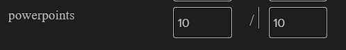

#### Step 1 Explanation

This step is about creating the new attribute `powerpoints` with a value of 10 and a max of 10.

In tutorial 1 we have seen ScriptCards [Object Modification](https://wiki.roll20.net/Script:ScriptCards#Object_Modification_.28--.21.29) using `--!`.

Since we are wanting to work on an attribute we'll use the shortcut `a` `--!a:`

With this being an attribute tied to the character, we add the selected token's character_id. `--!a:@{selected|character_id}|`

Reminder that Roll20 attribute references `@{}` are resolved before ScriptCards runs.

After the pipe character, we then see a new aspect of object modification, the exclamation point `!`.

When ScriptCards modifies attributes with its object modification, the default behavior is to update the attribute if it exists but if it does not exist, then it would not create the attribute. Using the exclamation point, says to create the attribute if does not exist.

In our example, `!powerpoints:10` will create an attribute named powerpoints with a current value of 10. We then use `|powerpoints^:10` to set the `max` of powerpoints to 10. We saw in tutorial 2 that attributes have a `current` property and a `max` property and the caret symbol `^` is how ScriptCards accesses the `max` property.

### Step 2 - Let's start on our cool homebrew ability Power Surge

The first step of our Power Surge ability will be the Charge step. The Charge step will be where the player decides how many Power Points they want to use for their Power Surge. For our purposes we will say that each Charge can have a maximimum power of 5.

```text
!script {{
    --&FeatureName|Power Surge

    --#title|[&FeatureName]
    --#sourceToken|@{selected|token_id}
    --&PowerPointsInCharge|?{Power Points to Charge|1|2|3|4|5}

    --+Charging|You selected [&PowerPointsInCharge] power points
}}
```
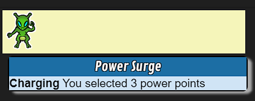

#### Step 2 Explanation

This ScriptCard uses features we have all seen in tutorial 1 and tutorial 2.

The core of this ScriptCard prompts the user for input using Roll20's [Roll Query](https://wiki.roll20.net/Roll_Query) to present the drop down to the user.

We then just say how many power points were chosen. However this doesn't store that information anywhere and so everyone would need to remember how many charges were there. So in the next step we are going to store that information so we can easily see it and retreive it.

### Step 3 - Let's add a token status marker

Now there are lots of ways to store information and they all have their pluses and minuses. In this tutorial we are going to use a status marker on the token. It stores information in a way that also provides a visual reminder for player and GM.

```text
!script {{
    --&FeatureName|Power Surge
    --&ChargeMarker|lightning-helix

    --#title|[&FeatureName]
    --#sourceToken|@{selected|token_id}
    --&PowerPointsInCharge|?{Power Points to Charge|1|2|3|4|5}

    --!t:[*S:t-id]|statusmarkers:[&ChargeMarker]@[&PowerPointsInCharge]

    --+Charging|You selected [&PowerPointsInCharge] power points
}}
```
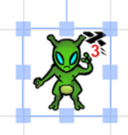

#### Step 3 Highlighted Differences

#### Step 3 Explanation

In step 3, we set a string variable to hold the name of the token marker we want to use for Charge.

`lightning-helix` is from the default Roll20 marker set, feel free to set `--&ChargeMarker|` to any token you feel like.

The other line we added is more object modification that we've looked at previously.

If you recall, `--!t:` is a shortcut for modifying Roll20 [Graphic](https://help.roll20.net/hc/en-us/articles/360037772793-API-Objects#API:Objects-Graphic(Token/Map/Card/Etc.)) objects.

From the Roll20 Objects link above we see the following information about the statusmarker property format:

>Comma-delimited (use join to create or split to turn into an array).
>If a status icon/color is followed by an "@" symbol, the number after
>"@" will be shown as the badge on the icon

>statusmarkers = "red,blue,skull,dead,brown@2,green@6"

So in our example we can set the statusmarkers property with the marker we choose `[&ChargeMarker]`, an `@` symbol, and the number of power points chosen for the Charge.

Putting that all together we get `--!t:[*S:t-id]|statusmarkers:[&ChargeMarker]@[&PowerPointsInCharge]`

### Step 4 - Let's add a check to see if we already have a Charge

```text
!script {{
    --&FeatureName|Power Surge
    --&ChargeMarker|lightning-helix

    --#title|[&FeatureName]
    --#sourceToken|@{selected|token_id}

    --?"[*S:t-statusmarkers]" -inc "[&ChargeMarker]"|[
        --+[*S:t-name]|already has a Charge ready
    --]|[
        --&PowerPointsInCharge|?{Power Points to Charge|1|2|3|4|5}
        --!t:[*S:t-id]|statusmarkers:[&ChargeMarker]@[&PowerPointsInCharge]
        --+Charging|You selected [&PowerPointsInCharge] power points
    --]|
}}
```
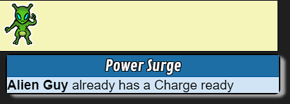

#### Step 4 Explanation

In step 4 we add a conditional on the token's statusmarkers property `--?"[*S:t-statusmakers]"` but we use a new comparison `-inc` which means includes. So if `"[&ChargeMarker]"` string appears anywhere in `"[*S:t-statusmarkers]"`, the condition will evaluate to true.

The list of comparators supported by ScriptCards is available [here](https://wiki.roll20.net/Script:ScriptCards#Comparators).

In previous tutorials, our conditions would usually result in moving to code branches `|LABELNAME` or calling procedures `|>LABELNAME` but this example uses a ScriptCards feature called [Code Blocks](https://wiki.roll20.net/Script:ScriptCards#Code_Blocks).

Code blocks will allow multiple statements to take place inside the block. `|[ TRUE STUFF HERE --]|[ FALSE STUFF HERE --]|`. Code blocks are opened with `|[` after the condition. Code blocks are closed with `--]|` and if you would like an "else" block you use `--]|[` which will close the true block and open the false block.

In our true code block, all we do is output that our character already has a Charge if the `[&ChargeMarker]` is present in `t-statusmarkers`.

In our false block, we have the roll query, the modification of statusmarkers to add the `[&ChargeMarker]`, and the output of the selected choice.

However when we run this script, while the output is correct, the Roll20 roll query will run immediately regardless of whether the marker is present. This is because, as previously mentioned, Roll20 will process all attribute calls `@{}`, all ability calls `%{}`, and all roll queries `?{}` before passing the processed values on to ScriptCards.

In the next step, we will look at an alternative way of getting information that will respect ScriptCards conditions.

### Step 5 - Let's Add Some Buttons. You Like Buttons Don't You?

```text
!script {{
    --&FeatureName|Power Surge
    --&ChargeMarker|lightning-helix

    --#title|[&FeatureName]
    --#sourceToken|@{selected|token_id}
    --#reentrant|[&FeautreName][*S:character_id]
    --#whisper|self

    --?"[*S:t-statusmarkers]" -inc "[&ChargeMarker]"|AlreadyCharged
    --&choiceMsg|
    --%points|1;5;1
        --&choiceMsg|+ [rbutton][&points]::Charge;[&points][/rbutton]
    --%|
    --+|[c][b]Points to use in Charge[/b][/c]
    --+|[c][&choiceMsg][/c]

    --:Done|
    --X|
    --:AlreadyCharged|
        --+[*S:t-name]|already has a Charge ready
    --^Done|
    --:Charge|PointsInTheCharge
        --#whisper|0
        --&PowerPointsInCharge|[&reentryval]
        --!t:[*S:t-id]|statusmarkers:[&ChargeMarker]@[&PowerPointsInCharge]
        --+Charging|You selected [&PowerPointsInCharge] power points
    --^Done|
}}
```
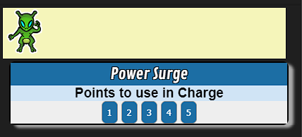

#### Step 5 Explanation

So in step 5, we replace the Roll20 roll query we used previously `?{}` with a ScriptCards feature [Reentrant Scripts](https://wiki.roll20.net/Script:ScriptCards#Reentrant_Scripts).

We specify the re-entry option with the setting `--#reentrant|` and to make it unique so multiple players could use this without overlapping we make it unique by adding the character id. `[&FeatureName][*S:character_id]`

We also specify the setting to whisper the output to ourselves for the choice. `--#whisper|self`

As you see, we have refactored the code a bit. We maintained the condition check but have moved the true code block to a code label `--:AlreadyCharged|`. So if we run this ScriptCard and the ChargeMarker is present, we will output that we already have a Charge ready and exit.

If the ChargeMarker is not present we continue and declare a new String variable `--&choiceMsg|` and make it empty.

We then start a ScriptCards [Loop](https://wiki.roll20.net/Script:ScriptCards#For...Next_Loops) with `--%points|1;5;1`.

Previously we used a `foreach` loop. In this example we use a `for` loop. As with the `foreach` loop, the `for` loop also sets a String variable. In our example that string variable will be named `points`. After the pipe character we see a semi-colon `;` separated list `1;5;1`.

In `for` loops, the first number `1` is what we start our loop as. So the first time this loop runs, `[&points]` will be `1`. The second number `5` is the max number. The third number `1` is by how much we will increase each loop. So in our example, first loop `[&points]` will be 1. Second loop, 2. Third loop, 3. Fourth loop, 4. Fifth loop? You guessed it. 5.

Inside the `for` loop, we concatenate to the `--&choiceMsg|+ ` and we introduce the first buttons in our tutorials `[rbutton]`. In ScriptCards `[rbutton]` is the statement for [Reentrant Buttons](https://wiki.roll20.net/Script:ScriptCards#Reentrant_Buttons). Which is a key aspect of re-entry scripts.

For rbuttons, the syntax is `[rbutton]Button Text::CODEBRANCHNAME;stringtopass[/rbutton]`.

Re-entrant buttons pass a String into the code branch specified. That string variable is then picked up by `[&reentryval]`.

So in our example, our button text is `[&points]` so 1,2,3,4,or 5 depending on the loop. We tell ScriptCards the code branch to re-join when a rbutton is pushed is the `--:Charge|` branch. and then we pass in the value of `[&points]`.

After our loop we display some center and bolded output and then output our `[&choiceMsg]` variable which contains our 5 button choices.

When clicked, we set `--&PowerPointsInCharge|` to `[&reentryval]` and do the same object modification and output we've used previously. We also set `--#whisper|` to 0, which turns off whisper setting and outputs to chat as normal.

### Step 6 - Let's Add Some Options For the Charge, Yes that means more buttons

```text
!script {{
    --&FeatureName|Power Surge
    --&ChargeMarker|lightning-helix

    --#title|[&FeatureName]
    --#sourceToken|@{selected|token_id}
    --#reentrant|[&FeautreName][*S:character_id]
    --#whisper|self

    --?"[*S:t-statusmarkers]" -inc "[&ChargeMarker]"|AlreadyCharged
    --&choiceMsg|
    --%points|1;5;1
        --&choiceMsg|+ [rbutton][&points]::Charge;[&points][/rbutton]
    --%|
    --+|[c][b]Points to use in Charge[/b][/c]
    --+|[c][&choiceMsg][/c]

    --:Done|
    --X|
    --:AlreadyCharged|
        --~Charge|string;after;@;[*S:t-statusmarkers]
        --+|[c][b]How Do You Want to Discharge?[/b][/c]
        --&chargeChoiceMsg|[rbutton]ZAPP!!!::SingleDamage;[&Charge][/rbutton]
        --&chargeChoiceMsg|+ [r][rbutton]KABOOM!!!::AreaPush;[&Charge][/rbutton][/r]
        --+|[&chargeChoiceMsg]
    --^Done|
    --:Charge|PointsInTheCharge
        --#whisper|0
        --&PowerPointsInCharge|[&reentryval]
        --!t:[*S:t-id]|statusmarkers:[&ChargeMarker]@[&PowerPointsInCharge]
        --+Charging|You selected [&PowerPointsInCharge] power points
    --^Done|
    --:SingleDamage|ChargePower
        --#whisper|0
        --=SurgeDamage|[&reentryval]d8
        --+ZAPP!!!|You dispelled your charge for [$SurgeDamage] damage to your target
    --^Done|
    --:AreaPush|ChargePower
        --#whisper|0
        --+KABOOM!!!|You dispelled your charge and everyone within 2 squares is pushed [&reentryval] squares away.
    --^Done|
}}
```
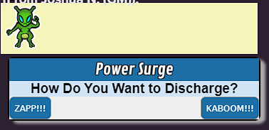

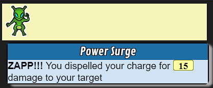

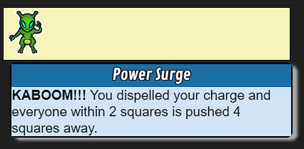

#### Step 6 Explanation

In step 6 we move into the `--:AlreadyCharged|` label to give our player a choice of abilities to use when there is a charge.

We start with a ScriptCards [Built-in Function](https://wiki.roll20.net/Script:ScriptCards#Categorized_Functions) `--~` in this case `string;after` function. In this case, the function with take the final parameter, `[*S:t-statusmarkers]` and search for the previous parameter `@` and then set the remaining string after the `@` to a string variable named `Charge` that we specified before the pipe `--~Charge|`.

With our current charge marker, we have an `@4` at the end. So in our example, we have a String variable `[&Charge]` set to `4`.

Some of you may already see some potential issues with this method, especially if we have multiple status markers set on a token, but let's keep the simple case of only 1 marker set for now and we'll address those issues in later steps.

Similar to the charge choice, we present a centered and bolded choice description and then concatenate rbutton's into a single string variable. The first rbutton will display button text as `ZAPP!!!` which would send a string of the `[&Charge]` value to a label named `SingleDamage`. The second rbutton will display button text of `KABOOM!!!` which would send a string of the `[&Charge]` value to a label named `AreaPush`.

We then create two labelled sections for our rbuttons, `--:SingleDamage|` and `--:AreaPush|`. Reminder that anything specified after the pipe character is not used and is really a helpful way to comment what is being passed into the label. So in our case `--:SingleDamage|ChargePower` is a way to remind our future selves and anyone that would want to use this ScriptCard that something is being passed in and a short description of what.

In both labels, we disable the whisper setting `--#whisper|0` so that we can output as normal.

In the `--:SingleDamage|` label we create a Roll variable to roll a number of d8's equal to the amount of our Charge. `--=SurgeDamage|[&reentryval]d8`.

We then display our `[$SurgeDamage]` roll variable.

In the `--:AreaPush|` label, output that area push will push everyone within 2 squares of us away by a number of squares equal to our charge.

In the next steps, we'll add more to these powers so they are not simply chat output. This is ScriptCards, we can do more!

### Step 7 - Let's Add a Target Choice to ZAPP!!!

"Hey, you've kept telling us that Roll20 will process all attribute references `@{}` before ScriptCards runs. That would include `@{target}` choices", you may be screaming at your monitor right now. Well it turns out that buttons offer an opportunity to make a ScriptCards friendly target choice. One such way is using ScriptCards [Information Request](https://wiki.roll20.net/Script:ScriptCards#Information_Request_.28--i.29) `--i` statement which whispers a button but since we already have a button, we'll use a different way.

```text
!script {{
    --&FeatureName|Power Surge
    --&ChargeMarker|lightning-helix
    --&HPBar|1

    --/|Helper variable build up to allow us to include a target prompt in an rbutton
    --&TB|& --&TB|+# --&TB|+64 --&TB|+; --&TB|+{

    --#title|[&FeatureName]
    --#sourceToken|@{selected|token_id}
    --#reentrant|[&FeautreName][*S:character_id]
    --#whisper|self

    --?"[*S:t-statusmarkers]" -inc "[&ChargeMarker]"|AlreadyCharged
    --&choiceMsg|
    --%points|1;5;1
        --&choiceMsg|+ [rbutton][&points]::Charge;[&points][/rbutton]
    --%|
    --+|[c][b]Points to use in Charge[/b][/c]
    --+|[c][&choiceMsg][/c]

    --:Done|
    --X|
    --:AlreadyCharged|
        --~Charge|string;after;@;[*S:t-statusmarkers]
        --+|[c][b]How Do You Want to Discharge?[/b][/c]
        --&chargeChoiceMsg|[rbutton]ZAPP!!!::SingleDamage;[&TB]Target|token_id}%[&Charge][/rbutton]
        --&chargeChoiceMsg|+ [r][rbutton]KABOOM!!!::AreaPush;[&Charge][/rbutton][/r]
        --+|[&chargeChoiceMsg]
    --^Done|
    --:Charge|PointsInTheCharge
        --#whisper|0
        --&PowerPointsInCharge|[&reentryval]
        --!t:[*S:t-id]|statusmarkers:[&ChargeMarker]@[&PowerPointsInCharge]
        --+Charging|You selected [&PowerPointsInCharge] power points
    --^Done|
    --:SingleDamage|ChargePower
        --#whisper|0
        --#targetToken|[&reentryval(split,%,0)]
        --=SurgeDamage|[&reentryval(split,%,1)]d8
        --#emoteText|[*T:t-name] feels a sharp ZAPP!!! from [*S:t-name]
        --+ZAPP!!!|You dispelled your charge for [$SurgeDamage] damage to your target [*T:t-name]
        --vbetweentokens|[*S:t-id] [*T:t-id] beam-holy
        --!t:[*T:t-id]|bar[&HPBar]_value:-=[$SurgeDamage.Total]
    --^Done|
    --:AreaPush|ChargePower
        --#whisper|0
        --+KABOOM!!!|You dispelled your charge and everyone within 2 squares is pushed [&reentryval] squares away.
    --^Done|
}}
```
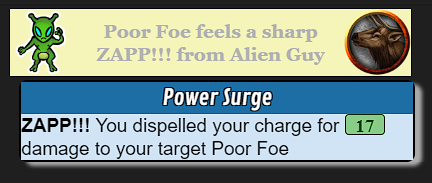

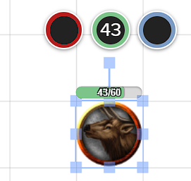

#### Step 7 Explanation

In step 7, we spruce up the `ZAPP!!!` option of our Power Surge ability. We start with adding a String variable for `--&HPBar|` which we have seen in previous tutorials. In my token setup, HP is on bar1, so we set `--&HPBar|` to 1. If your token has HP on a different bar, feel free to change.

Next new lines we see are a comment and a new String variable `--&TB|`. These 2 lines are stolen straight from one of Kurt J's example ScriptCards [here](https://github.com/kjaegers/ScriptCards/blob/main/ScriptCards_Examples/system-neutral/BuildTargetListWithRButtons.scard). Kurt's Github repo has a number ScriptCards examples that may be useful to you. In this case we will be taking the `--&TB|` String variable to use in our ZAPP!!! rbutton to allow us to choose a target.

Looking at that line, you see String variable concatenation that we've seen and used a number of times to put together a string of `&`, `#`, `64`, `;`, and `{`. Ampersand `&`, pound `#` are used in [HTML Entities](https://wiki.roll20.net/HTML_Entities) and are often used in place of special characters. In this example, `64` corresponds to the `@` symbol, which would make our string `@{`. You may now see how this bit of String manipulation with the rbutton might allow us to pick a target if the button is clicked.

The next line that is different is the ZAPP!!! rbutton line. You can see that the button display text has not changed and remains `ZAPP!!!` and the code label to resume the ScriptCard has not changed `--:SingleDamage|`. What has changed is the String value we send with the rbutton. We use the String variable `[&TB]`, which we now know is `@{`, then `Target|token_id}%[&Charge]`. So if the ZAPP!!! rbutton is pressed, the text sent in chat contains `@{Target|token_id}%4` with our current charge value of 4. As we've gone over, Roll20 attribute references are processed when sent in chat so `@{Target|token_id}` will prompt to pick a target and its `token_id` is passed in to `--:SingleDamage|`

Moving to the `--:SingleDamage|` code label, we see that `[&reentryval]` which is the string of the information we passed in via the rbutton is now used in 2 new lines. First we set the `--#targetToken|` setting with `[&reentryval(split,%,0)]`. This is the first time in these tutorials we have seen [Expanded String Referencing](https://wiki.roll20.net/Script:ScriptCards#Expanded_String_Referencing).

We have previously seen [Built-in Functions](https://wiki.roll20.net/Script:ScriptCards#Categorized_Functions) which there are many `string;` built-in functions but there are many that are available what we'll call `inline`, meaning right when you reference the String variable. In our example `[&reentryval(split,%,0)]` means the string should be split on any `%` symbols found and return the 1st part of that split. Looking at our rbutton we pass in the token id, `%`, and the charge. Since the token id won't have any `%` symbols, we can be confident that `[&reentryval(split,%,0)]` will be the target's token id.

Note that there is nothing at all special with the `%` symbol as a separator or delimiter in our string. It can be any character or set of characters you want. Just choose what is very unlikely to appear in the other parts you are passing in.

Next we see our Roll variable `--=SurgeDamage|` and this uses an inline split as well to get the number of d8's to roll based on our current Charge value. So `[&reentryval(split,%,1)]` will split the string passed in on the `%` as before but this time it will send the 2nd string it finds. In our example, there is only 1 `%`, so 1 happens to the be `[&Charge]` we passed in.

Since we have a target now, we set the `--#emoteText|` setting and our output to include the target's token name `[*T:t-name]`.

We then introduce a new ScriptCards statment `--v` for [Visual Effects](https://wiki.roll20.net/Script:ScriptCards#Visual_Effects_.28--v.29). We want to add a little pizzazz to Zapp!!!. So we use `--vbetweentokens|` which has us pass in the source token as the origin of the effect, the target token id as the destination, and then `beam-holy`. Beam being one of the [Built-in Effects](https://help.roll20.net/hc/en-us/articles/360037258714-Effects-F-X-Tool#F/XTool-Built-inEffects) and holy being one of the built-in colors. Holy is the only yellow-ish one which seemed more fitting for Zapp!!!.

Finally, we do object modification on the target token to reduce the bar1_value by the damage we rolled. We use a [Roll Modifier](https://wiki.roll20.net/Script:ScriptCards#Roll_Modifiers). We've used `.Base` previously but in this case we use `.Total` which is the end result without any formatting.

### Step 8 - Let's Talk About Page Settings and Graphic Properties

So step 8 is not about ScriptCards. You may be thinking, well then it doesn't have any place in a ScriptCards tutorial, but for many automation steps you want, you will need to know about other Roll20 aspects. If you know all about Roll20 [Page Objects](https://help.roll20.net/hc/en-us/articles/360037772793-API-Objects#API:Objects-Page) and [Graphic Objects](https://help.roll20.net/hc/en-us/articles/360037772793-API-Objects#API:Objects-Graphic(Token/Map/Card/Etc.)) and their properties, then skip this step and proceed to step 9.

Ok, now that all the know-it-alls are gone, let's talk about Roll20 pages and tokens. In this case, we'll talk about pages step up with with Square Grids enabled. This example is not going to talk about other types like hexes and whatnot. We're only going to be dealing with the default square grid setup of a page.

So if we place our character token in the very top-left square of the page and place our target token 2 squares to the right
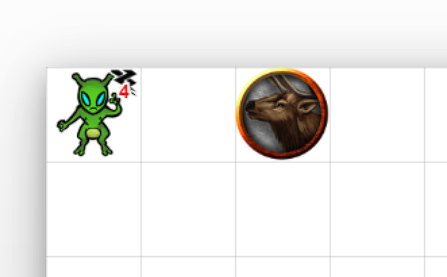

```text
!script {{
    --#sourceToken|@{selected|token_id}
    --#targetToken|@{target|token_id}
    --+Source|Left:[*S:t-left] Top:[*S:t-top] Width:[*S:t-width] Height:[*S:t-height]
    --+Target|Left:[*T:t-left] Top:[*T:t-top] Width:[*T:t-width] Height:[*T:t-height]
}}
```
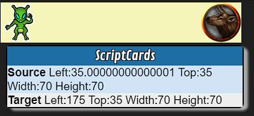

So running our ScriptCard we see the character token in the very top left square has a left number of `35` and a top number of `35`. We're going to ignore any very tiny decimals for now. They are but a rounding error when that small. We also see that our character token has a width of 70 and a height of 70. These numbers all have a unit of pixels.

You may be familiar with the Roll20 Page Settings which has this number.
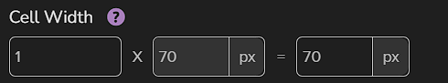
When set to 1, all the squares 70 pixels x 70 pixels. Roll20 coordinates are all based on 0,0 being the very top-left of the page.

So we have a character token that is 1 square wide and 1 square high on a page that each square is 70 pixels wide and 70 pixels tall.

So that brings us to the `left` and `top` properties that are `35`. Roll20 graphic objects all get their centers placed by these coordiates. So the coordinates of the very top left corner of our characters token would be 0 and 0. And we know the token is 70 pixels wide and 70 pixels tall. So the bottom right corner would 70 and 70. The center coordinates for use would be half of each therefore `35` and `35`.

Looking at the target token we see that it also is 70x70 pixels wide and tall;same 1 square size as our character. We also see that it has the same `top` coordiates of `35`. This makes sense since it is also on the top row and is the exact same size as our character. The target's left coordinate is `175`. We know from above that our page has squares that are 70 pixels wide so if our character is at `left:35` and our target is at `left:175` that is 140 pixels difference, and that equals 2 squares, which we can see for ourselves is correct.

The Roll20 API, and in our case ScriptCards, can manipulate these coordinates. So let's have our character swap places with the target.

```text
!script {{
    --#sourceToken|@{selected|token_id}
    --#targetToken|@{target|token_id}
    --&originalSourceLeft|[*S:t-left]
    --&originalSourceTop|[*S:t-top]
    --&originalTargetLeft|[*T:t-left]
    --&originalTargetTop|[*T:t-top]

    --!t:[*S:t-id]|left:[&originalTargetLeft]|top:[&originalTargetTop]
    --!t:[*T:t-id]|left:[&originalSourceLeft]|top:[&originalSourceTop]
}}
```

Running that ScriptCard and you should see the 2 tokens swap positions.
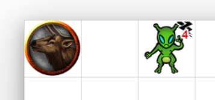
Run it again and they will swap back.

Hopefully you have a little better understanding of Roll20 pages and graphic placement now and how we can use them to know where we are on the grid, where we are compared to other tokens, and how we can use object modification to manipulate the placement, height, and width of tokens.

### Step 9 - Let's Make our KABOOM Pop

So in step 9 we are going introduce an area effect push. For simplicity we are going to say that diagonal squares are the same as up/down or left/right squares. If you want to deal with Euclid and Pythagoras, you can do that as a challenge exercise but for step 9, let's put away our Geometry/Trig hats. Also, let's move our character and target tokens to the middle of the page for now.

```text
!script {{
    --&FeatureName|Power Surge
    --&ChargeMarker|lightning-helix
    --&HPBar|1
    --&maxKaboomDistance|2

    --/|Helper variable build up to allow us to include a target prompt in an rbutton
    --&TB|& --&TB|+# --&TB|+64 --&TB|+; --&TB|+{

    --#title|[&FeatureName]
    --#sourceToken|@{selected|token_id}
    --#reentrant|[&FeautreName][*S:character_id]
    --#whisper|self

    --?"[*S:t-statusmarkers]" -inc "[&ChargeMarker]"|AlreadyCharged
    --&choiceMsg|
    --%points|1;5;1
        --&choiceMsg|+ [rbutton][&points]::Charge;[&points][/rbutton]
    --%|
    --+|[c][b]Points to use in Charge[/b][/c]
    --+|[c][&choiceMsg][/c]

    --:Done|
    --X|
    --:AlreadyCharged|
        --~Charge|string;after;@;[*S:t-statusmarkers]
        --+|[c][b]How Do You Want to Discharge?[/b][/c]
        --&chargeChoiceMsg|[rbutton]ZAPP!!!::SingleDamage;[&TB]Target|token_id}%[&Charge][/rbutton]
        --&chargeChoiceMsg|+ [r][rbutton]KABOOM!!!::AreaPush;[&Charge][/rbutton][/r]
        --+|[&chargeChoiceMsg]
    --^Done|
    --:Charge|PointsInTheCharge
        --#whisper|0
        --&PowerPointsInCharge|[&reentryval]
        --!t:[*S:t-id]|statusmarkers:[&ChargeMarker]@[&PowerPointsInCharge]
        --+Charging|You selected [&PowerPointsInCharge] power points
    --^Done|
    --:SingleDamage|ChargePower
        --#whisper|0
        --#targetToken|[&reentryval(split,%,0)]
        --=SurgeDamage|[&reentryval(split,%,1)]d8
        --#emoteText|[*T:t-name] feels a sharp ZAPP!!! from [*S:t-name]
        --+ZAPP!!!|You dispelled your charge for [$SurgeDamage] damage to your target [*T:t-name]
        --vbetweentokens|[*S:t-id] [*T:t-id] beam-holy
        --!t:[*T:t-id]|bar[&HPBar]_value:-=[$SurgeDamage.Total]
    --^Done|
    --:AreaPush|ChargePower
        --#whisper|0
        --+KABOOM!!!|You dispelled your charge and everyone within 2 squares is pushed [&reentryval] squares away.
        --~Tokens|array;pagetokens;AllTokensArr;[*S:t-id];char
        --&nearTokens|0
        --vtoken|[*S:t-id] burst-magic
        --%tid|foreach;AllTokensArr
            --?"[&tid]" -eq "[*S:t-id]"|%
            --~Distance|distance;[*S:t-id];[&tid]
            --?[$Distance] -gt [&maxKaboomDistance]|%
            --&nearTokens|[= [&nearTokens] + 1]
            -->PushToken|[*S:t-id];[&tid];[&reentryval]
        --%|
        --+|[&nearTokens] token(s) were caught in your KABOOM's blast radius
    --^Done|
    --:PushToken|SourceToken;PushTarget;SquaresToPush
        --&_squareSizeInPixels|[= 70 * [*O:[*[%1%]:t-_pageid]:page:snapping_increment] ]
        --&_pageHeight|[*O:[*[%1%]:t-_pageid]:page:height]
        --&_pageWidth|[*O:[*[%1%]:t-_pageid]:page:width]
        --&_targetHalfHeight|[= [*[%2%]:t-height] / 2]
        --&_targetHalfWidth|[= [*[%2%]:t-width] / 2]
        --&_maxX|[= [&_pageWidth] - 1 * [&_squareSizeInPixels] + [&_targetHalfWidth] ]
        --&_maxY|[= [&_pageHeight] - 1 * [&_squareSizeInPixels] + [&_targetHalfHeight] ]

        --=_deltaX|[*[%2%]:t-left] - [*[%1%]:t-left]
        --=_deltaY|[*[%2%]:t-top] - [*[%1%]:t-top]
        --&_slopeX|0
        --?[$_deltaX] -gt 0|&_slopeX;1
        --?[$_deltaX] -lt 0|&_slopeX;-1
        --&_slopeY|0
        --?[$_deltaY] -gt 0|&_slopeY;1
        --?[$_deltaY] -lt 0|&_slopeY;-1
        --&_diffX|[= [&_squareSizeInPixels] * [%3%] * [&_slopeX] ]
        --&_diffY|[= [&_squareSizeInPixels] * [%3%] * [&_slopeY] ]

        --=NewLeft|[*[%2%]:t-left] + [&_diffX] {MIN:[&_targetHalfWidth]} {MAX:[&_maxX]}
        --=NewTop|[*[%2%]:t-top] + [&_diffY] {MIN:[&_targetHalfHeight]} {MAX:[&_maxY]}
        --!t:[%2%]|top:[$NewTop.Total]|left:[$NewLeft.Total]
    --<|
}}
```

#### Step 9 Explanation

In step 9, we flesh out the KABOOM option. We start by adding a String variable `--&maxKaboomDistance|` and setting that to 2. We define that near the top of the script so that we can more easily find and change that if we ever decide we need to tweak the KABOOM ability.

Now we get into the changed `--:AreaPush|` label. We start by using a ScriptCards built-in function that we've used previously, `array;pagetokens`. `array;pagetokens` with the `char` filter will return all tokens on the page with the source token `[*S:t-id]` that are linked to a character. This should typically cover all NPC and PC tokens on the page.

We define a String variable `--&nearTokens|` and set it to 0 as a way to keep a counter for the number of tokens we push.

We then add another visual effect with `--v` this time `--vtoken|` which we say is on the source token `[*S:t-id]` with a `burst` effect and `magic` color.

We then use a `foreach` loop to go through all the token ids returned by `array;pagetokens` in our `AllTokensArr` array.

Then we introduce a new option in the first conditional. If the token id in the loop equals the source token's id, we just skip to the next loop. `--%|` in a loop is a way to move to the next loop iteration. In a conditional, it looks like `|%`.

We then use another built-in function, this time `distance`. To get the distance between the source token and the current token id.

If this token is farther away than the max number of squares in our `maxKaboomDistance` variable, we use the `%` to skip to the next iteration.

If the token is within range, we then use some inline mathematics on our `--&nearTokens|` variable to increase the count by 1. `[= ]` will allow you to perform inline mathematics. Note that there is no order of operations (no PEMDAS) in ScriptCards. All mathematical operations are processed left to right regardless of what normal math operations would do.

We then call the `--:PushToken|` procedure and pass in the source token id, the target token id, and the current charge which will be the number of squares we push the targets. The `--:PushToken|` procedure has a bit more math involved and Roll20 bits which is why we took step 8 to give a brief overview of Roll20 [Page](https://help.roll20.net/hc/en-us/articles/360037772793-API-Objects#API:Objects-Page) and [Graphic](https://help.roll20.net/hc/en-us/articles/360037772793-API-Objects#API:Objects-Graphic(Token/Map/Card/Etc.)) objects.

In step 8 we looked at Cell Width in the page settings, well the Page property for that is `snapping_increment`. We retreive the snapping_increment and multiply it by the default 70 pixels to get the size of each square on the page in pixels. We also retrieve the page's height and width which are in numbers of squares. We also take the target token's height and width numbers and divide them by 2. In step 8, we showed that token coordinates are given based on the center of the token so halving the height and width of our target will give us that center. We then use all of those retreived values to find the maximum number of pixels our target can be at without being pushed off the edge of the page.

Now we take the target's left and top coordinates and subtract them from the source token's left and top coordinates to get the difference between the two tokens. We do this not to get how far apart the tokens are but the difference will give us the relative position the target token is from the source. If the difference is positive we are going to add to target's coordinates to push. If the difference is negative, we are going to subtrace from the target's coordinates to push away from the source. We then take our current Charge which was passed in as the third parameter `[%3%]` and multiply it by the number of pixels in a square and then we multiply by the slope, which is either going to -1, 0, or 1. This will give us the number we will add to the target coordinates.

We then use 2 Roll variables to calculate the new left and top for the target based on current left and top and adding the diff values. Remember the diff is positive if we need to increase to push away, or the diff could be negative if we need to decrease to push away from the source token. We then use some [Roll Mathematical Functions](https://wiki.roll20.net/Script:ScriptCards#Mathematical_Functions_in_Roll_Expressions) to set a MIN and a MAX. We don't want to push our target token off the page.

Finally we use object modification on the token to set the left and top properties.

PHEW. We did it. I promise the rest of this tutorial will have a lot less math involved. If you got all that, great. Well done! If you are still unsure, don't worry. You'll get it. I recommend taking some tokens and playing around with something like:

```text
!script {{
    --#sourceToken|@{selected|token_id}
    --#targetToken|@{target|token_id}
    --+Source|Left:[*S:t-left] Top:[*S:t-top] Width:[*S:t-width] Height:[*S:t-height]
    --+Target|Left:[*T:t-left] Top:[*T:t-top] Width:[*T:t-width] Height:[*T:t-height]
}}
```

That would let you see how token coordinates work on your page and if you adjust a token's height and/or width, how that impacts the coordinates. I promise you that it's not deep math and you will get it by playing around and exploring what those numbers show when you move things around.

### Step 10 - Let's talk about status markers

So after we have both the ZAPP and KABOOM options working, we should remove the status marker when the current charge is dispelled. But if we recall from earlier in the tutorial, statusmarkers are a comma-separated list of markers. So if we need to remove our marker, ScriptCards cannot just use `-=Marker`. That will not remove the marker from a comma separated string. So we need some string manipulation to handle adding and removing a single marker from a list when there can be multiple markers present.

Rather than writing our own code, let's channel our inner developers and be lazy and use someone else's code to do what we need. In ScriptCards, we can do this with [Libraries](https://wiki.roll20.net/Script:ScriptCards#Libraries). In our case, one library in particular will help us with the markers, [Kurt J's system neutral library](https://raw.githubusercontent.com/kjaegers/ScriptCards/main/ScriptCards_Examples/libraries/systemneutrallib.scard).

So in order to use this library, we need to create a new Handout.


We then name the handout `ScriptCards Library systemneutrallib`
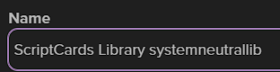

We then copy the raw output from the Github link above into the handout's Description and Notes field.
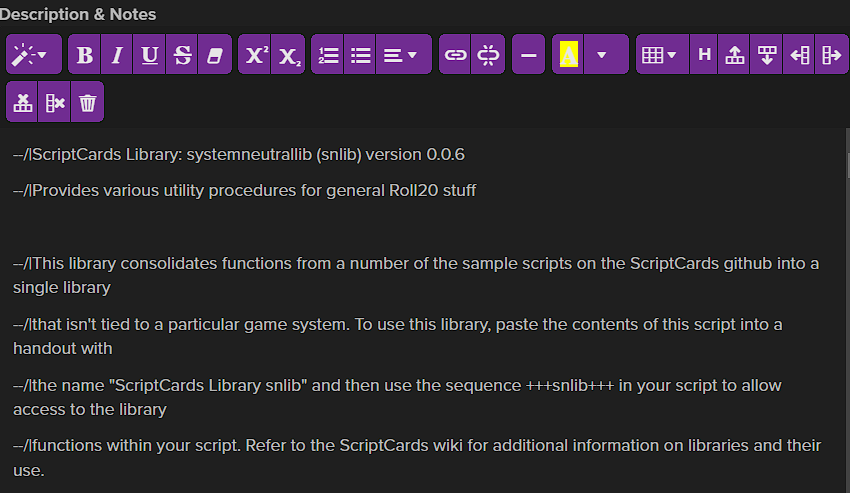

Now you can save and close the handout.

```text
!script {{
    --&FeatureName|Power Surge
    --&ChargeMarker|lightning-helix
    --&HPBar|1
    --&maxKaboomDistance|2

    +++systemneutrallib+++
    --/|Helper variable build up to allow us to include a target prompt in an rbutton
    --&TB|& --&TB|+# --&TB|+64 --&TB|+; --&TB|+{

    --#title|[&FeatureName]
    --#sourceToken|@{selected|token_id}
    --#reentrant|[&FeautreName][*S:character_id]
    --#whisper|self

    --?"[*S:t-statusmarkers]" -inc "[&ChargeMarker]"|AlreadyCharged
    --&choiceMsg|
    --%points|1;5;1
        --&choiceMsg|+ [rbutton][&points]::Charge;[&points][/rbutton]
    --%|
    --+|[c][b]Points to use in Charge[/b][/c]
    --+|[c][&choiceMsg][/c]

    --:Done|
    --X|
    --:AlreadyCharged|
        -->LibSN_CHECK_STATUS_MARKER|[*S:t-id];[&ChargeMarker];;Charge
        --+|[c][b]How Do You Want to Discharge?[/b][/c]
        --&chargeChoiceMsg|[rbutton]ZAPP!!!::SingleDamage;[&TB]Target|token_id}%[&Charge][/rbutton]
        --&chargeChoiceMsg|+ [r][rbutton]KABOOM!!!::AreaPush;[&Charge][/rbutton][/r]
        --+|[&chargeChoiceMsg]
    --^Done|
    --:Charge|PointsInTheCharge
        --#whisper|0
        --&PowerPointsInCharge|[&reentryval]
        -->LibSN_ADD_STATUS_MARKER|[*S:t-id];[&ChargeMarker];[&PowerPointsInCharge]
        --+Charging|You selected [&PowerPointsInCharge] power points
    --^Done|
    --:SingleDamage|ChargePower
        --#whisper|0
        --#targetToken|[&reentryval(split,%,0)]
        --=SurgeDamage|[&reentryval(split,%,1)]d8
        --#emoteText|[*T:t-name] feels a sharp ZAPP!!! from [*S:t-name]
        --+ZAPP!!!|You dispelled your charge for [$SurgeDamage] damage to your target [*T:t-name]
        --vbetweentokens|[*S:t-id] [*T:t-id] beam-holy
        --!t:[*T:t-id]|bar[&HPBar]_value:-=[$SurgeDamage.Total]
        -->LibSN_REMOVE_STATUS_MARKER|[*S:t-id];[&ChargeMarker]
    --^Done|
    --:AreaPush|ChargePower
        --#whisper|0
        --+KABOOM!!!|You dispelled your charge and everyone within 2 squares is pushed [&reentryval] squares away.
        --~Tokens|array;pagetokens;AllTokensArr;[*S:t-id];char
        --&nearTokens|0
        --vtoken|[*S:t-id] burst-magic
        --%tid|foreach;AllTokensArr
            --?"[&tid]" -eq "[*S:t-id]"|%
            --~Distance|distance;[*S:t-id];[&tid]
            --?[$Distance] -gt [&maxKaboomDistance]|%
            --&nearTokens|[= [&nearTokens] + 1]
            -->PushToken|[*S:t-id];[&tid];[&reentryval]
        --%|
        --+|[&nearTokens] token(s) were caught in your KABOOM's blast radius
        -->LibSN_REMOVE_STATUS_MARKER|[*S:t-id];[&ChargeMarker]
    --^Done|
    --:PushToken|SourceToken;PushTarget;SquaresToPush
        --&_squareSizeInPixels|[= 70 * [*O:[*[%1%]:t-_pageid]:page:snapping_increment] ]
        --&_pageHeight|[*O:[*[%1%]:t-_pageid]:page:height]
        --&_pageWidth|[*O:[*[%1%]:t-_pageid]:page:width]
        --&_targetHalfHeight|[= [*[%2%]:t-height] / 2]
        --&_targetHalfWidth|[= [*[%2%]:t-width] / 2]
        --&_maxX|[= [&_pageWidth] - 1 * [&_squareSizeInPixels] + [&_targetHalfWidth] ]
        --&_maxY|[= [&_pageHeight] - 1 * [&_squareSizeInPixels] + [&_targetHalfHeight] ]

        --=_deltaX|[*[%2%]:t-left] - [*[%1%]:t-left]
        --=_deltaY|[*[%2%]:t-top] - [*[%1%]:t-top]
        --&_slopeX|0
        --?[$_deltaX] -gt 0|&_slopeX;1
        --?[$_deltaX] -lt 0|&_slopeX;-1
        --&_slopeY|0
        --?[$_deltaY] -gt 0|&_slopeY;1
        --?[$_deltaY] -lt 0|&_slopeY;-1
        --&_diffX|[= [&_squareSizeInPixels] * [%3%] * [&_slopeX] ]
        --&_diffY|[= [&_squareSizeInPixels] * [%3%] * [&_slopeY] ]

        --=NewLeft|[*[%2%]:t-left] + [&_diffX] {MIN:[&_targetHalfWidth]} {MAX:[&_maxX]}
        --=NewTop|[*[%2%]:t-top] + [&_diffY] {MIN:[&_targetHalfHeight]} {MAX:[&_maxY]}
        --!t:[%2%]|top:[$NewTop.Total]|left:[$NewLeft.Total]
    --<|
}}
```

#### Step 10 Explanation

In step 10 we created a handout with naming convention that ScriptCards uses for its libraries `ScriptCards Library systemneutrallib`. Then we updated our Power Surge ScriptCard to use the library by adding the library syntax `+++systemneutrallib+++`. When that is placed in a ScriptCard, we will be able to use any functions/procedures that are in that library.

Then we update our `--:AlreadyCharged|` label to use `LibSN_CHECK_STATUS_MARKER` to get the current charge rather than the built-in function `string;after`. The `string;after` function would have failed if any other statusmarker was after our ChargeMarker. The `LibSN_CHECK_STATUS_MARKER` now does the work for us and sets the `Charge` variable to current charge that we have set on the marker.

We then update our `--:Charge|` label to use `LibSN_ADD_STATUS_MARKER` procedure to add our ChargeMarker. In our previous steps, we just set the statusmarkers property to our ChargeMarker which would complete overwrite any other markers present on our token. Now we can add our marker without disturbing any other markers.

Finally we update our `--:SingleDamage|` and `--:AreaPush|` labels to remove our charge marker when the charge is expelled. This library function saves us from having to manipulate the string and recreating it without our ChargeMarker present. Again the remove marker procedure leaves any other markers on the token undisturbed.

### Step 11 - Let's Deduct the Power Points

Up until now, we've left the powerpoints resource we created alone. Now it's time to check for resources available and to deduct resources used.

```text
!script {{
    --&FeatureName|Power Surge
    --&ChargeMarker|lightning-helix
    --&HPBar|1
    --&maxKaboomDistance|2
    --&maxPointsPerCharge|5

    +++systemneutrallib+++
    --/|Helper variable build up to allow us to include a target prompt in an rbutton
    --&TB|& --&TB|+# --&TB|+64 --&TB|+; --&TB|+{

    --#title|[&FeatureName]
    --#sourceToken|@{selected|token_id}
    --#reentrant|[&FeautreName][*S:character_id]
    --#whisper|self

    --?"[*S:t-statusmarkers]" -inc "[&ChargeMarker]"|AlreadyCharged
    --?[*S:powerpoints] -eq 0|>FatalError;Insufficient Resources;ERROR;No more powerpoints remaining to create a charge
    --?[*S:powerpoints] -lt [&maxPointsPerCharge]|&maxCharge;[*S:powerpoints]|&maxCharge;[&maxPointsPerCharge]
    --&choiceMsg|
    --%points|1;[&maxCharge];1
        --&choiceMsg|+ [rbutton][&points]::Charge;[&points][/rbutton]
    --%|
    --+|[c][b]Points to use in Charge[/b][/c]
    --+|[c][&choiceMsg][/c]

    --:Done|
    --X|
    --:AlreadyCharged|
        -->LibSN_CHECK_STATUS_MARKER|[*S:t-id];[&ChargeMarker];;Charge
        --+|[c][b]How Do You Want to Discharge?[/b][/c]
        --&chargeChoiceMsg|[rbutton]ZAPP!!!::SingleDamage;[&TB]Target|token_id}%[&Charge][/rbutton]
        --&chargeChoiceMsg|+ [r][rbutton]KABOOM!!!::AreaPush;[&Charge][/rbutton][/r]
        --+|[&chargeChoiceMsg]
    --^Done|
    --:Charge|PointsInTheCharge
        --#whisper|0
        --&PowerPointsInCharge|[&reentryval]
        -->LibSN_ADD_STATUS_MARKER|[*S:t-id];[&ChargeMarker];[&PowerPointsInCharge]
        --+Charging|You selected [&PowerPointsInCharge] power points
        --!a:[*S:character_id]|powerpoints:-=[&PowerPointsInCharge]
    --^Done|
    --:SingleDamage|ChargePower
        --#whisper|0
        --#targetToken|[&reentryval(split,%,0)]
        --=SurgeDamage|[&reentryval(split,%,1)]d8
        --#emoteText|[*T:t-name] feels a sharp ZAPP!!! from [*S:t-name]
        --+ZAPP!!!|You dispelled your charge for [$SurgeDamage] damage to your target [*T:t-name]
        --vbetweentokens|[*S:t-id] [*T:t-id] beam-holy
        --!t:[*T:t-id]|bar[&HPBar]_value:-=[$SurgeDamage.Total]
        -->LibSN_REMOVE_STATUS_MARKER|[*S:t-id];[&ChargeMarker]
    --^Done|
    --:AreaPush|ChargePower
        --#whisper|0
        --+KABOOM!!!|You dispelled your charge and everyone within 2 squares is pushed [&reentryval] squares away.
        --~Tokens|array;pagetokens;AllTokensArr;[*S:t-id];char
        --&nearTokens|0
        --vtoken|[*S:t-id] burst-magic
        --%tid|foreach;AllTokensArr
            --?"[&tid]" -eq "[*S:t-id]"|%
            --~Distance|distance;[*S:t-id];[&tid]
            --?[$Distance] -gt [&maxKaboomDistance]|%
            --&nearTokens|[= [&nearTokens] + 1]
            -->PushToken|[*S:t-id];[&tid];[&reentryval]
        --%|
        --+|[&nearTokens] token(s) were caught in your KABOOM's blast radius
        -->LibSN_REMOVE_STATUS_MARKER|[*S:t-id];[&ChargeMarker]
    --^Done|
    --:PushToken|SourceToken;PushTarget;SquaresToPush
        --&_squareSizeInPixels|[= 70 * [*O:[*[%1%]:t-_pageid]:page:snapping_increment] ]
        --&_pageHeight|[*O:[*[%1%]:t-_pageid]:page:height]
        --&_pageWidth|[*O:[*[%1%]:t-_pageid]:page:width]
        --&_targetHalfHeight|[= [*[%2%]:t-height] / 2]
        --&_targetHalfWidth|[= [*[%2%]:t-width] / 2]
        --&_maxX|[= [&_pageWidth] - 1 * [&_squareSizeInPixels] + [&_targetHalfWidth] ]
        --&_maxY|[= [&_pageHeight] - 1 * [&_squareSizeInPixels] + [&_targetHalfHeight] ]

        --=_deltaX|[*[%2%]:t-left] - [*[%1%]:t-left]
        --=_deltaY|[*[%2%]:t-top] - [*[%1%]:t-top]
        --&_slopeX|0
        --?[$_deltaX] -gt 0|&_slopeX;1
        --?[$_deltaX] -lt 0|&_slopeX;-1
        --&_slopeY|0
        --?[$_deltaY] -gt 0|&_slopeY;1
        --?[$_deltaY] -lt 0|&_slopeY;-1
        --&_diffX|[= [&_squareSizeInPixels] * [%3%] * [&_slopeX] ]
        --&_diffY|[= [&_squareSizeInPixels] * [%3%] * [&_slopeY] ]

        --=NewLeft|[*[%2%]:t-left] + [&_diffX] {MIN:[&_targetHalfWidth]} {MAX:[&_maxX]}
        --=NewTop|[*[%2%]:t-top] + [&_diffY] {MIN:[&_targetHalfHeight]} {MAX:[&_maxY]}
        --!t:[%2%]|top:[$NewTop.Total]|left:[$NewLeft.Total]
    --<|
    --:FatalError|emoteText;ErrorHeader;ErrorMessage
        --#emoteText|[%1%]
        --+[%2%]|[%3%]
    --^Done|
}}
```
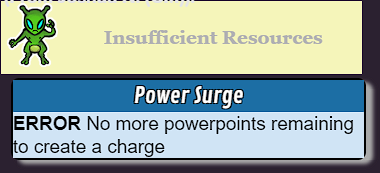

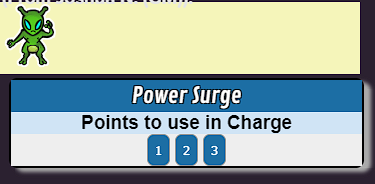

#### Step 11 Explanation

In step 11, we create a new String variable `maxPointsPerCharge`. Previously we had used the number 5 in our `for` loop for the charge to set the maximum but here we specify the max in a variable.

We add a conditional check to see if there are no more powerpoints available and if true, send an error message to the `--:FatalError|` procedure we've used in previous tutorials.

We add another conditional to check if we have fewer powerpoints than our max per charge. If so, our max is now the remaining powerpoints value. If not, our max is the number we've specified in our maxPointsPerCharge variable. We set a new String variable to hold this value and use that for the max value of our `for` loop. This makes our `for` loop adjust to our available points.

In our `--:Charge|` label, we then use object modification on the powerpoints attribute to decrement the powerpoints current value by the number of points we used in our charge.

## Recap and References

And with that we are going to stop the tutorial here, we could add other options besides ZAPP and KABOOM. We could add saves made by the target to resist the damage or the push. We could add debug logging options so that we can more easily get information about the workings of our Power Surge ScriptCard but I will leave all those options for you to explore on your own.

Hopefully you were able to follow along as we learned ways to gather information at ScriptCard runtime, store that information in way that we can visually see and track for later use, use re-entry functionality and buttons to provide choices, use those buttons as a way to get around some Roll20 chat limitations for targetting, learned how to get token coordinates and modify token coordinates to automate token movement, and use ScriptCards libraries to share code in ScriptCards that either others have written or common code that we want to use in multiple ScriptCards we write, without having to copy and paste code around all the time.

### Language Features
* [Code Blocks](https://wiki.roll20.net/Script:ScriptCards#Code_Blocks) - Code blocks allow conditional statements to contain multiple statements inside them
* [Loop](https://wiki.roll20.net/Script:ScriptCards#For...Next_Loops) - a new style of loop. the `for` loop.
* [Reentrant Scripts](https://wiki.roll20.net/Script:ScriptCards#Reentrant_Scripts) - Used with rbuttons to provide choice and restart a ScriptCard at a specific point with that choice being sent as a string
* [Visual Effects](https://wiki.roll20.net/Script:ScriptCards#Visual_Effects_.28--v.29)
* [Libraries](https://wiki.roll20.net/Script:ScriptCards#Libraries) - useful ways to share and consume shared ScriptCards functions
* [Inline String Functions](https://wiki.roll20.net/Script:ScriptCards#Expanded_String_Referencing) - built-in string functions that work when using using a string variable `[&VariableName(tolowercase)]`
* [Roll Mathematical Functions](https://wiki.roll20.net/Script:ScriptCards#Mathematical_Functions_in_Roll_Expressions) - Min and Max boundaries on a roll variable

### Roll20 Features Covered
* [Page objects](https://help.roll20.net/hc/en-us/articles/360037772793-API-Objects#API:Objects-Page)
* [Graphic objects](https://help.roll20.net/hc/en-us/articles/360037772793-API-Objects#API:Objects-Graphic(Token/Map/Card/Etc.))
